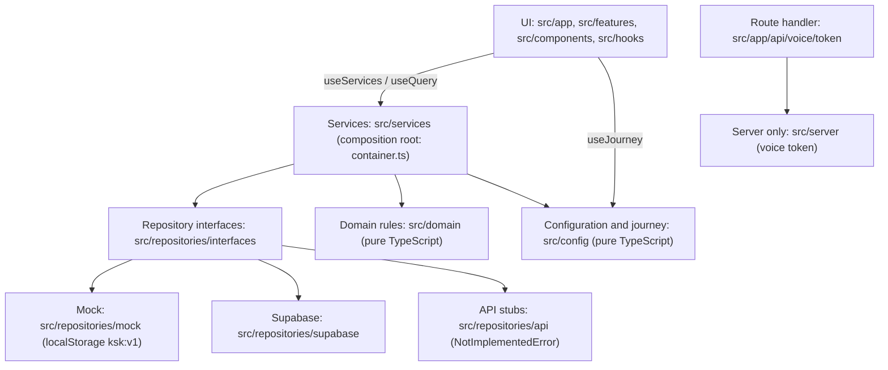
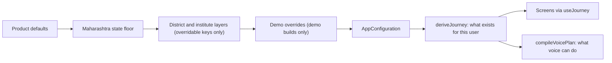
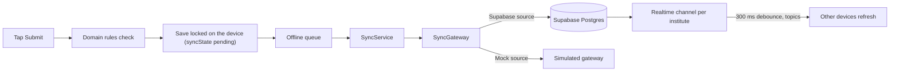
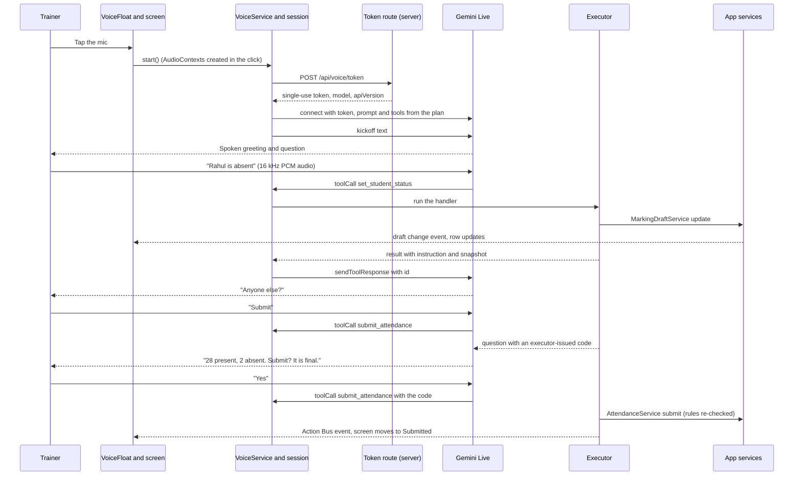

# KSK Attendance MiniApp (Maharashtra)

A mobile-first attendance app for craft instructors and principals at Industrial Training Institutes (ITIs) in Maharashtra, opened as a MiniApp inside the SwiftChat Android app. Instructors mark student attendance once per batch, principals oversee the institute, mark staff and correct same-day mistakes with a reason, and an optional Voice Agent lets either role work by speaking in English or Marathi.

This README is also the technical and product handover. It explains what the app does, why it is built the way it is, how to run and test it, and what it can and cannot do today.

## At a glance

| | |
|---|---|
| **For** | ITI craft instructors (regular, contractual, guest, group instructors) and principals. Students never use it. |
| **Runs in** | The SwiftChat Android WebView on low-end phones (320 to 412 px wide). It also runs in any modern browser on a tablet, laptop or projector. |
| **Stack** | Next.js 16 (App Router, static pages) · React 19.2 · TypeScript 5.9 · CSS Modules on SwiftChat design tokens · Supabase (shared demo backend) · Gemini Live (Voice Agent) · MediaPipe BlazeFace (on-device face detection) · Vitest and Playwright |
| **Status** | Stakeholder demo build. Data comes from an on-device mock or a shared Supabase demo backend, both behind repository interfaces. Real APIs plug in later without UI changes. Not deployed by tooling (prepare-only). |
| **Languages** | English and Marathi (UI and voice). Voice understands mixed Hindi but never replies in Hindi. |
| **Owner rules** | Git and deployment belong to the owner. Nobody commits, pushes or deploys unless the owner asks. |

## Contents

1. [Quick start](#1-quick-start)
2. [Product overview](#2-product-overview)
3. [Feature catalogue](#3-feature-catalogue)
4. [Tech stack](#4-tech-stack)
5. [Architecture](#5-architecture)
6. [Repository structure](#6-repository-structure)
7. [Data, backends and offline](#7-data-backends-and-offline)
8. [Voice Agent](#8-voice-agent)
9. [Configuration](#9-configuration)
10. [Demo layer](#10-demo-layer)
11. [Testing and quality](#11-testing-and-quality)
12. [Deployment](#12-deployment)
13. [Capabilities and limitations](#13-capabilities-and-limitations)
14. [Decisions and further reading](#14-decisions-and-further-reading)
15. [Handover checklist](#15-handover-checklist)
16. [Glossary](#16-glossary)

---

## 1. Quick start

### Prerequisites

- Node.js `>=20.9 <27` (from `package.json` `engines`). `npm run test:supabase-live` needs Node 20.12 or later; on older Node it skips.
- npm.
- macOS is needed only for the optional spoken voice rehearsal (`npm run voice:ui-rehearsal`), which uses the `say` command.
- A secure context for camera, location and microphone: `http://localhost` works; a phone on your LAN needs HTTPS (`next dev --experimental-https`) or a tunnel to a production build.

### Install and run

```bash
npm install
cp .env.example .env.development   # optional, see below
npm run dev                         # http://localhost:3000
```

`npm run dev` first runs `scripts/vendor-mediapipe.mjs`, which copies the MediaPipe wasm files into `public/vendor/mediapipe/0.10.35/` (git-ignored; copied when missing or changed). `npm run build` runs it too.

Open a demo story straight from the URL:

| URL | Opens as |
|---|---|
| `http://localhost:3000/?preset=open` | Rajesh Patil, an instructor who may mark any trade (Maharashtra's model) |
| `http://localhost:3000/?preset=principal` | Dr. Anil Deshmukh, the principal |
| `http://localhost:3000/?preset=first_time` | A first-time user at the login screen, face not registered |
| `http://localhost:3000/?preset=offline` | The instructor with no network and records waiting to sync |

All nine presets are listed in [Demo layer](#10-demo-layer). You can also use the **Demo accounts** list on the login screen (institute code `27410`).

### Environment files

Only `.env.example` is in git. It documents variable names. Copy it to `.env.development` (or `.env.development.local`, which wins) and fill in what you need. Never commit values.

| Variable | Needed for | If missing |
|---|---|---|
| `NEXT_PUBLIC_DEMO_MODE` | Demo layer on (`true`) or off (`false`) | `next.config.ts` defaults it to `true` |
| `NEXT_PUBLIC_DATA_SOURCE` | `mock` forces the on-device mock; any other value (including `supabase`) behaves like unset | Chosen automatically (Supabase when both Supabase variables are set) |
| `NEXT_PUBLIC_SUPABASE_URL`, `NEXT_PUBLIC_SUPABASE_PUBLISHABLE_KEY` | The shared Supabase demo backend | The app runs on the on-device mock |
| `GEMINI_API_KEY` | Voice Agent with the real model | Voice Agent is unavailable; the rest of the app works. The demo's **Scripted** voice model still works. |
| `VOICE_DISABLED` | Kill switch (`1` turns voice off) | Voice on |
| `VOICE_ALLOWED_ORIGINS` | Extra origins allowed to mint voice tokens | Only the page's own origin |

Without the file, the three voice scripts (`voice:spike-token`, `voice:spike-voices`, `test:voice-live`) stop with "not found" because they use Node's `--env-file`. With the file but no key, `test:voice-live` skips.

### Main npm scripts

| Script | What it does |
|---|---|
| `npm run dev` | Development server on port 3000 (demo mode by default) |
| `npm run build` / `npm start` | Production build (every page static, one route handler) and serve |
| `npm run lint` | ESLint 9 flat config, including the architecture boundaries |
| `npm run typecheck` | `tsc --noEmit` |
| `npm test` / `npm run test:watch` | Vitest unit and integration tests |
| `npm run e2e` | Playwright: builds on the mock source, serves on port 3200, Pixel 5 at 360 px, Asia/Kolkata |
| `npm run check` | lint, typecheck, test and build in one go. Run it before finishing any change. |
| `npm run check:demo` | Builds with the demo off and proves no demo code shipped |
| `npm run icons` | Regenerates icons from `Doc/mh_ksk_logo.png` (the original is never modified) |
| `npm run test:voice-live` | Opt-in: about 40 text conversations against the real Gemini model (needs `GEMINI_API_KEY`, costs quota) |
| `npm run test:supabase-live` | Opt-in: the Supabase repositories against the live project, test institute `99999` only |
| `npm run voice:ui-rehearsal -- <scenario.json>` | Opt-in, macOS: speaks scripted lines into Chromium's fake microphone against a running app with a key |
| `npm run voice:spike-token` / `voice:spike-voices` | Opt-in: mint a token and time first audio / render sample voices to WAV |

---

## 2. Product overview

### The problem

ITI attendance has to be marked quickly and honestly on cheap phones, in bright workshops, often one-handed, with 20 to 35 students per batch, patchy network and varied digital literacy. The target is to mark a 30-student batch in well under a minute. Attendance must not be backdated, edited after submission without a trace, or marked by someone who is not physically at the institute.

### One product, configured per state

Every state difference is a configuration value, not code. Every feature ships built; configuration decides whether it appears. A disabled feature is **absent**, never greyed out. This repository is the Maharashtra instance (`src/config/states/maharashtra.ts`). The product rules come from `Doc/PRD.pdf`; the approved layout, copy and flow come from `prototype/Prototype.html`.

Non-goals: student views, payroll, HR or leave management, timetable authoring, OJT declaration (that belongs to the ERP), and backdating of any kind.

### Users

| Role | What they do | Can correct? |
|---|---|---|
| Instructor (regular, contractual, guest) | Marks the batches the mapping rules allow, marks own attendance (first, in Maharashtra), sees own reports | No |
| Group instructor | Everything an instructor does, plus a read-only overview of a whole trade | No |
| Principal | Institute overview, Attendance board (Students and Staff), staff marking, same-day corrections with a reason, institute reports and the staff report card. May mark an unsubmitted batch while its window is open. | Yes |

### Core flows

**Instructor**

1. **Sign in:** institute code, then "Is this your institute?", then Trainer ID (format like `TR-10432`), then "Is this you?". No password or OTP yet (PRD open question).
2. **First time only:** register a face with three guided photos (straight, left, right). Matching is simulated; photos are never stored.
3. **Own attendance first** (Maharashtra, D-152): location check, face check, then one tap "Mark present". Until then every class says "Mark your attendance first".
4. **Mark a batch:** open the class, pass "Verify your presence" (location then face), then the roster opens with everyone Present. Change only the exceptions with one status select per student.
5. **Review and submit:** the review shows totals and the names of exceptions. Submit saves at once and locks the record for everyone. Offline, it is saved and locked on the phone and syncs later.
6. **Reports:** this month's own attendance, batches and at-risk students; a monthly register download.

**Principal**

1. Home shows today's student and staff progress and a "Needs attention" list.
2. The Attendance tab shows the institute board (Students) and staff marking (Staff).
3. Corrections: from today's synced record, pick a student, choose the new status, give a reason, confirm. The original is never modified; the correction is appended.
4. Reports add institute figures, batch attendance by trade, at-risk students, the staff attendance report card and the staff register.

### Voice Agent in one paragraph

Voice Agent is an optional floating microphone on every signed-in screen where voice is enabled. An instructor can mark a batch by speaking ("who is absent?", "anyone else?", "submit"), mixed freely with taps, in English or Marathi. Both roles can ask for their status, mark their own attendance, hear report figures, open the register sheet, hear announcements and open screens. The principal can mark staff by voice. Corrections stay tap-only because they need a reason and an audit trail. Anything final (submit, "mark the rest present", a staff mark) needs one spoken yes to a question that carries a code the app issued. Audio is processed by Google (Gemini Live) and never stored. The tap flow keeps working at every moment. Details in [Voice Agent](#8-voice-agent).

### Languages

English and Marathi throughout (`src/i18n/messages/en.ts` is the source of truth, `mr.ts` the translation). Montserrat is the English font and Mukta the Marathi font, switched by `:lang(mr)`. Marathi uses Latin digits (D-012). Master data names stay in Latin script. The Marathi text still needs a native review (D-027).

### Product rules no configuration can relax

These live in `src/domain/rules.ts` and are enforced by services and repositories, never only by hiding a button.

| Rule | Meaning |
|---|---|
| INV-01 Submit once | After submission the record is locked for everyone. |
| INV-05 No backdating | Only today can be marked or corrected. |
| INV-20 Hard time fence | A batch can be marked only inside its window; no grace period. A missed window stays a visible gap. |
| INV-16 Verification before the list | The roster opens only after location and face checks pass; submit re-checks it. |
| D-152 Own attendance first | Where configured, an instructor marks their own attendance before any batch. |
| Corrections (INV-06 to 09, 14) | Principal only, today only, reason required, must change something, record must be synced. Append-only. |
| OJT | Comes only from ERP declarations; never chosen or corrected in the app. |
| INV-22 Staff | One mark per person per day across self and principal; the first mark wins; a self mark needs verification. |
| Time | All dates and times are IST. |

---

## 3. Feature catalogue

### Sign-in and profile

| Feature | What it does | Code |
|---|---|---|
| Login steps | Institute code, confirm institute, Trainer ID, confirm identity | `src/features/auth/` |
| Face registration | Three guided photos with the real front camera; matching simulated; "Do this later" | `src/features/face/`, `src/services/face.ts` |
| Demo accounts | Demo builds only: one tap picks a persona; both confirmations still follow | `src/features/auth/LoginAssistList.tsx`, `src/services/login-assist.ts` |
| Profile menu | Avatar (top right of every screen) opens identity, language, face registration, help, logout. There is no profile tab. | `src/features/profile/ProfileMenu.tsx` |

### Instructor

| Feature | What it does | Code |
|---|---|---|
| Home | Greeting by real time of day, own attendance card, sync pending card, announcements, today's classes, submitted today | `src/features/home/InstructorHome.tsx` |
| Own attendance | Location and face check, then "Mark present"; reuses a pass from the last 10 minutes for the next batch | `src/features/staff/SelfAttendanceScreen.tsx` |
| Class gateway | Syncs first, then refuses with a reason (not open yet, closed, not downloaded, not assigned, already submitted) or runs verification | `src/features/attendance/OpenSessionScreen.tsx`, `src/features/verification/` |
| Roster | One native status select per student, options only from configuration; OJT and saved marks locked; one summary tile per status | `src/features/attendance/mark/`, `src/components/ui/AttendanceStatusSelect.tsx`, `AttendanceSummary.tsx` |
| Review and submit | Totals, exception names, "this attendance can't be edited"; one confirmation per submit (D-149) | `src/features/attendance/review/` |
| Record | Read-only view of the session it was opened for (D-150) | `src/features/attendance/record/RecordScreen.tsx` |
| Trade overview | Group instructors only: a whole trade at a glance | `src/features/home/`, `journey.tradeWideView` |

### Principal

| Feature | What it does | Code |
|---|---|---|
| Principal Home | Student and staff progress, "Needs attention" (unsubmitted batches, unmarked staff) | `src/features/home/PrincipalHome.tsx` |
| Attendance board | Students (trades and batches) and Staff tabs | `src/features/attendance/AttendanceTabScreen.tsx` |
| Corrections | Same-day change with a reason and confirmation; append-only | `src/features/principal/CorrectScreen.tsx`, `src/services/corrections.ts` |
| Staff marking | Fill gaps for staff who did not self-mark; self marks are locked; partial result when someone marked meanwhile | `src/features/staff/StaffScreen.tsx`, `src/services/staff-attendance.ts` |

### Reports, registers, offline and notices (both roles)

| Feature | What it does | Code |
|---|---|---|
| Reports page | One page for this month, rows and cards, never tables: My attendance, My batches, At-risk (below 75%); principal adds Institute, Batch attendance by trade and the Staff attendance report card (D-154) | `src/features/reports/`, `src/services/reports.ts` |
| Detail reports | Staff attendance and correction log with date ranges; browser print or save as PDF | `src/features/reports/`, `DETAIL_BLOCKS` in `src/services/reports.ts` |
| Monthly register | Per batch, per trade, and the staff register (principal); this month to date or last month; self-contained HTML that prints on A4 landscape, labelled as sample data in demo builds (D-137) | `src/services/report-register.ts`, `src/features/reports/register/`, `src/lib/download.ts` |
| Offline data | Download batches to mark offline, refresh one or all, see what is waiting to sync; available to every user (D-153) | `src/features/offline/`, `src/services/sync.ts`, `src/services/packs.ts` |
| Announcements | Six demo notices on Home with fixed category colour, icon and word (an extension, D-054) | `src/features/announcements/` |
| Voice Agent | Floating mic and card; see section 8 | `src/features/voice/`, `src/services/voice/` |
| Voice diagnostics | Checks secure context, microphone, AudioWorklet, sample rates, WebView detection; copy report | `src/features/voice/diagnostics/` (route `/voice/diagnostics`) |

### Routes

All pages are static; ids travel in the query string (`src/lib/routes.ts`).

`/login`, `/login/institute`, `/login/trainer`, `/login/identity`, `/face?next=`, `/home`, `/attendance`, `/attendance/staff`, `/attendance/trade?trade=`, `/attendance/open?s=`, `/attendance/mark?s=`, `/attendance/review?s=`, `/attendance/submitted?s=`, `/attendance/record?s=`, `/attendance/correct?s=&student=`, `/me/attendance`, `/reports`, `/reports/view?r=&range=`, `/reports/offline`, `/reports/offline/download`, `/voice/diagnostics`. Old `/profile` links redirect to `/home` and `/profile/offline` to `/reports/offline`.

Navigation is `journey.navTabs`: **Home · Reports** for instructors (Home owns today's classes) and **Home · Attendance · Reports** for the principal. It is a bottom bar on phones and a header row from 600 px, never a sidebar.

---

## 4. Tech stack

Runtime dependencies are exactly six packages, all pinned.

| Technology | Version | Used for | Why |
|---|---|---|---|
| Next.js (App Router, Turbopack) | 16.3.6 | Routing, static prerender of every page, one route handler | Static shells deploy anywhere and load fast in a WebView (D-005, D-006). Next 16 has breaking changes: read `node_modules/next/dist/docs/` before using an unfamiliar API (see [AGENTS.md](AGENTS.md)). |
| React, React DOM | 19.2.8 | UI | D-005 |
| TypeScript | 5.9 (`^5`) | Strict types, `@/*` alias to `src/*` | Safety across layers |
| CSS Modules + design tokens | n/a | All styling; every colour, radius, type size and spacing is a token from `src/styles/tokens.css` and `typography.css` | The SwiftChat design system is authoritative; no UI library keeps the bundle small for low-end phones. A unit test enforces tokens. |
| `@supabase/supabase-js` | 2.117.2 (exact) | Shared demo backend: Postgres, RLS, Realtime | The owner wanted a shared live backend so a phone and a laptop see the same data (D-143). Loaded by `import()` only for the Supabase source. |
| `@google/genai` | 2.26.0 (exact) | Gemini Live (`gemini-3.8-live`) for Voice Agent; token minting on the server | Live config, tool-response shape and connect behaviour were verified on this exact version. Never `@google/generative-ai` (deprecated). |
| `@mediapipe/tasks-vision` | 0.10.35 (exact) | BlazeFace face detection for the on-device movement check | Version 1.x sends usage metrics to Google with no opt-out; 0.10.35 has the same API and makes no external request (D-049). Wasm is self-hosted. |
| Fonts via `next/font/google` | n/a | Montserrat (English), Mukta (Marathi) | Design system fonts, `display: swap` |
| Vitest, Testing Library, jsdom | 5.0.2, 16.3.3, 30.1.1 | Unit, integration and component tests | Fast runs on the mock container with zero simulated delay |
| Playwright, axe-core | 1.63.0, 4.13.0 | End-to-end tests on a Pixel 5 profile, accessibility scans | Real browser, IST, no key or network needed |
| ESLint, `eslint-config-next` | 9.39, 16.3.6 | Lint, architecture boundaries, file size warning | Boundaries are enforced, not just documented |
| sharp | 0.35.4 | `npm run icons` only | Derives icons from the logo |

There are deliberately **no** UI, state, date, animation, schema or i18n libraries. Internationalisation is home-grown (`src/i18n/`).

**Upgrading a pinned SDK** needs a re-check: `npm run test:voice-live` for `@google/genai`, `npm run test:supabase-live` for Supabase, and both `scripts/vendor-mediapipe.mjs` and the `MEDIAPIPE_VERSION` constant for MediaPipe (the script refuses any other version).

---

## 5. Architecture

### Shape of the app

The app is **client-first and static**. Every page is prerendered as a static shell. All data work runs in the browser, behind services and repository interfaces, so the mock, Supabase and a future API can be swapped without touching screens. The only server code is one route handler, `POST /api/voice/token`, which exists to keep the Gemini key off the client.

### Layers



Rules enforced by ESLint (`eslint.config.mjs`):

- The UI never imports `@/data/*`, `@/repositories/mock|api|supabase`, `@supabase/*`, `@/demo/*` or `@/server/*`. It reads data only through `useServices()` and `useQuery()`.
- The UI never branches on a role or a person. `.isPrincipal` is a lint error in UI code. Screens read capabilities from `useJourney()`.
- `src/domain` and `src/config` are pure TypeScript: no React, Next, services or storage.
- `src/services` (except `container.ts`) depends on interfaces only.
- `src/server` is reachable only from `src/app/api/**` and never imports React, services, demo or mock code.
- UI files (`src/app`, `src/features`, `src/components`, `src/hooks`) over 300 lines of code trigger a warning.

### The composition root

`src/services/container.ts` builds the repositories (mock or Supabase) and every service. `src/app-shell/boot.ts` creates the container in the browser: it chooses the data source (`src/app-shell/data-source.ts`), loads the Supabase client by `import()` only when needed, and loads the demo layer only in demo builds. Services are identical for both sources; only repositories differ.

### Configuration to journey



`src/config/journey.ts` is the only place that decides what exists for a user: navigation tabs, verification steps, marking options, own-attendance-first, reports, offline packs and voice. Screens never ask "is this a principal?"; they ask "does the journey have this capability?".

### Domain rules

`src/domain/rules.ts` holds the integrity checks and their error codes (for example `already_submitted`, `not_today`, `window_not_open`, `window_closed`, `not_verified`, `self_first`, `reason_required`, `ojt_locked`, `already_marked`). Services call them before saving; repositories enforce unique keys. Corrections are append-only, and `effectiveMarks()` folds them over the original submission. Domain code never calls `new Date()`: a `Clock` is injected (`src/lib/time.ts`, IST).

### Offline-first data flow



A record is saved and locked on the device first, then pushed. Reads merge the server with the device's own records. Details in [Data, backends and offline](#7-data-backends-and-offline).

### Realtime

On the Supabase source, one channel per signed-in institute listens to `submissions`, `corrections`, `staff_attendance` and `face_enrolment`. After a 300 ms debounce it drops that table's read cache and emits the app's topics (`attendance`, `corrections`, `staff`, `face`), so `useQuery` re-reads and a second device updates without a reload (`src/repositories/supabase/live.ts`).

### Voice architecture

The browser talks to Gemini Live directly with a single-use token. Tools run in the browser through the same services the screens use, so every rule that holds for a tap holds for voice.



The screen changes only through typed, sequenced **Action Bus** events (`src/services/voice/action-bus.ts`, applied by `src/features/voice/useActionBus.ts`), never from model text. Taps flow back to the model as `[APP]` texts.

### Demo seams

Everything the demo controls arrives through product seams, so a demo-off build simply plugs in real implementations:

| Seam | Demo build | Demo-off build |
|---|---|---|
| `Clock` | `DemoClock` (fixed 10:15 IST by default) | System clock |
| `SimulationSource` | `DemoSimulationSource` (location, face match, camera, permissions, network, sync failure, speed, voice model) | `StaticSimulationSource` with defaults and real device APIs |
| Configuration | Persona patch and panel overrides on top of the layers | Layers only |
| `LoginAssistSource` | Demo accounts on the login screen | `null`; nothing renders |

---

## 6. Repository structure

### Top level

```
.
├── AGENTS.md                Next 16 warning, re-added by `next dev`
├── CLAUDE.md                Binding guide for agents working in this repo (imports AGENTS.md)
├── README.md                This handover
├── package.json             Scripts and pinned dependencies
├── next.config.ts           Demo flag default, Permissions-Policy header, cache headers, redirects
├── eslint.config.mjs        Architecture boundaries and the 300-line warning
├── tsconfig.json            Strict, `@/*` -> `src/*`
├── vitest.config.mts        npm test (tests/unit + tests/integration)
├── vitest.voice-live.config.mts      opt-in live Gemini suite
├── vitest.supabase-live.config.mts   opt-in live Supabase smoke test
├── playwright.config.ts     E2E: mock source, port 3200, Pixel 5, Asia/Kolkata
├── .env.example             Variable names (the only env file in git)
├── src/                     The app
├── tests/                   unit, integration, e2e, voice-live, supabase-live, helpers
├── scripts/                 MediaPipe vendoring, icons, demo-strip check, Supabase seed tools, voice spikes and rehearsals
├── public/                  Branding, face model, mic worklet; vendor/ is generated
├── supabase/                SQL migrations, generated seed, verification queries
├── docs/                    Handover docs (only eight are tracked in git, see below)
├── Doc/                     Source inputs: PRD.pdf, logo, design system (local only, git-ignored)
└── prototype/               Prototype.html (local only, git-ignored)
```

### `src/`

```
src/
├── app/                     Next.js routes: thin pages that render a feature screen
│   ├── layout.tsx           Fonts, AppProviders
│   ├── (auth)/login/        Login steps
│   ├── (app)/layout.tsx     SessionGate + VoiceProvider (voice persists across routes)
│   ├── (app)/home, attendance/*, me/attendance, face, reports/*, voice/diagnostics
│   └── api/voice/token/route.ts   The only route handler (POST, nodejs runtime)
├── app-shell/               boot.ts (builds the container), data-source.ts, AppProviders.tsx
├── components/
│   ├── shell/               ScreenLayout (form | reading | wide), headers, nav, SessionGate,
│   │                        ToolSlot (demo trigger), TopBand, DockInset (where floating controls sit)
│   └── ui/                  SwiftChat DS kit: AttendanceStatusSelect, AttendanceSummary, Button, Card,
│                            Disclosure, Section, StatusLine, InlineNote, BottomSheet, Segmented, icons/ ...
├── config/                  types.ts, defaults.ts, states/maharashtra.ts, resolve.ts, validate.ts, journey.ts
├── data/mock/               Deterministic demo master data and today's story (seeds.ts)
├── demo/                    DEMO ONLY: state, clock, presets, personas, panel, Supabase seeder, voice puppet
├── domain/                  rules.ts, attendance.ts (effectiveMarks), status.ts, schedule.ts, access.ts,
│                            geo.ts, device.ts, marking.ts; voice/ (plan, flow, confirm codes, matching, voices)
├── features/                Screens by product area: auth, home, attendance, verification, face, staff,
│                            principal, reports, offline, announcements, profile, shell, feedback, voice, common
├── hooks/                   useServices, useQuery, session, i18n, sync, voice context
├── i18n/                    translate.ts, format.ts (IST), messages/en.ts and mr.ts
├── lib/                     time.ts (IST, Clock), kv-store.ts, events.ts, routes.ts, download.ts, platform.ts
├── repositories/
│   ├── interfaces/          The data seam: every repository contract (13 repositories)
│   ├── mock/                MockDatabase in localStorage, daily reseed
│   ├── supabase/            Second implementation: client.ts (only SDK import), merge, read cache, Realtime
│   └── api/                 Typed stubs that throw NotImplementedError and document endpoints
├── server/voice/            SERVER ONLY: token.ts (mint), guard.ts (Origin, per-IP limit, kill switch)
├── services/                Business logic
│   ├── container.ts         Composition root
│   ├── attendance, marking-draft, verification, location, face, corrections, staff-attendance,
│   │   sync, packs, session, auth, reports, report-register, announcements, simulation ...
│   ├── camera/              Real camera, MediaPipe detector, prototype movement check
│   ├── simulated/           Simulated face match, location, sync gateway, scripted voice transport
│   └── voice/               Voice Agent runtime: service, session, executor, handlers/, prompt, tools,
│                            live/ (Gemini transport), audio/ (worklet recorder, gapless player, earcons)
└── styles/                  tokens.css, typography.css, globals.css
```

### Key entry files

| File | Why it matters |
|---|---|
| `src/app-shell/boot.ts` | Where the app starts in the browser; picks the data source; loads demo code only in demo builds |
| `src/services/container.ts` | Composition root; the one place that knows about concrete repositories |
| `src/repositories/interfaces/index.ts` | Every repository contract |
| `src/domain/rules.ts` | The integrity rules |
| `src/config/journey.ts` | What exists for a user |
| `src/config/states/maharashtra.ts` | The state floor and its overridable keys |
| `src/services/voice/service.ts` | Voice Agent's single entry point for the UI |
| `src/domain/voice/plan.ts` | What voice can do in a session |
| `src/app/api/voice/token/route.ts` | The only server endpoint |

### What is in git

`.gitignore` ignores `/docs`, `/Doc`, `/prototype`, `/public/vendor/`, every `.env*` file except `.env.example`, `.next` and `.next-nodemo`. Only eight docs are tracked: ARCHITECTURE, CONFIGURATION, DATA_MODEL, DECISIONS, DEMO_GUIDE, DESIGN_SYSTEM, PRODUCT_CONTEXT and TESTING. `docs/SUPABASE.md`, `docs/voice/*` and `docs/plans/*` are local-only until added with `git add -f`. A fresh clone has no PRD, prototype, design-system document or original logo.

---

## 7. Data, backends and offline

### One set of interfaces, three implementations

| Implementation | Folder | Status |
|---|---|---|
| On-device mock | `src/repositories/mock/` | Working. Deterministic data in localStorage. |
| Shared Supabase demo backend | `src/repositories/supabase/` | Working. Shared by every device using the build. |
| API | `src/repositories/api/` | Typed stubs that throw `NotImplementedError`; each method documents its intended endpoint (for example `GET /institutes?code=`, `POST /attendance/{attendanceId}/corrections`). |

### Choosing the source

`resolveDataSource` (`src/app-shell/data-source.ts`): `NEXT_PUBLIC_DATA_SOURCE=mock` forces the mock. Otherwise the build uses Supabase when both `NEXT_PUBLIC_SUPABASE_URL` and `NEXT_PUBLIC_SUPABASE_PUBLISHABLE_KEY` are set, and the mock if not. In demo builds the panel's Data row can switch a device to "This device". Tests and E2E always run on the mock.

### Who owns what

| Server-owned (on the mock, kept on the device) | Always on the device |
|---|---|
| Master data, announcements, submissions, corrections, staff attendance, voice minutes, face-enrolment flags | Drafts, the offline queue, batch packs, verification passes, the session, preferences (language) |

Browser storage namespaces: `ksk:v1` (device data and the mock database), `ksk-prefs` (language), `ksk-cache:v1` (Supabase read cache and outboxes), `ksk-demo:v1` (demo state).

### Mock master data

Deterministic data in `src/data/mock/`:

- **Govt ITI Pune**, code `27410`: 5 trades (Electrician, Fitter, Welder, COPA, Mechanic Diesel), 17 batches, 417 students.
- **Govt ITI Nashik**, code `27613`: 1 trade, 1 batch, 20 students.
- 20 staff across both institutes (17 instructors, 1 group instructor, 2 principals): 18 at Pune (16 instructors, the group instructor, the principal) and 2 at Nashik. One subject: Employability Skills.
- Six announcements.
- History for the working days among the last 45 calendar days (Sundays off) is generated at read time from a deterministic random generator.
- `seeds.ts` builds today's story relative to the current date: some batches submitted this morning, most staff self-marked, one first-time user, one stale pack, yesterday's correction.

The mock database reseeds automatically when the IST calendar day changes and on schema bumps, keeping unsynced records. Mock services wait a simulated network time (`simulatedDelay`, scaled by demo speed, zero in tests) so loading states are real (D-059).

### Supabase

Project `ksk-attendance` in region `ap-south-1` (details in `docs/SUPABASE.md`, local-only). Only the publishable key reaches the browser: a client key protected by RLS. Never a secret or service-role key.

| Migration | Content |
|---|---|
| `20261005040007_ksk_schema.sql` | 15 tables (master data, `announcements`, `submissions`, `corrections`, `staff_attendance`, `voice_usage`, `face_enrolment`, `demo_meta`), triggers, RLS and grants |
| `20261005040037_ksk_realtime.sql` | Adds four tables to Realtime |
| `20261005040348_ksk_seed_function.sql` | `ksk_seed_day`: idempotent daily seed |
| `20261005041600_ksk_reset_functions.sql` | `ksk_reset_demo` and `ksk_cleanup_test_institute`; the owner pasted this into the SQL editor by hand |
| `20261005150000_ksk_corrections_seq.sql` | `corrections.seq`: one global correction order |

`supabase/seed/master-data.sql` and `test-institute.sql` (and `supabase/checks/master-fingerprints.sql`) are generated from the mock modules (`scripts/supabase/generate-seed.ts`); do not edit them by hand. A unit test regenerates them and fails on drift. Test institute `99999` exists for live tests.

**RLS is deliberately permissive for the demo (D-144).** Anyone with the publishable key can read all demo data, insert write-once records for any demo person and call the seed and reset functions. There are no updates or deletes on submissions, corrections or staff attendance. This is acceptable only for fictional data. The production hardening list is in [Handover checklist](#15-handover-checklist).

### Offline-first, step by step

1. **Device first.** Submit runs the domain rules, saves the record locked on the device with a `syncState` (`synced`, `pending`, `failed`, `rejected`) and queues it.
2. **SyncService** (`src/services/sync.ts`) pushes on reconnect, at app start, after queuing, before opening another batch and on "Sync now". Home shows the last failed attempt.
3. **Gateway.** A unique-key conflict with the same id is the device's own earlier push (success). A conflict with a different id is `rejected`: final, never retried, and the server's copy wins. Network errors are retried.
4. **Correction outbox.** Corrections are sent at once when online, otherwise kept in a device outbox that drains at start, on reconnect and with every sync. Every device orders corrections by (timestamp, `seq`, id).
5. **Read merge** (`merge.ts`). A record still waiting to sync wins for its key; otherwise the server's copy wins.
6. **Pruning.** After a live read, the device drops its own *synced* records that the server no longer has (after a shared reset). Never pending or rejected ones, never offline.
7. **Read cache.** Offline reads answer from the last server rows cached in `ksk-cache:v1`.
8. **Packs.** Users who can mark students download batch rosters for offline marking. A pack goes stale after `offline.refreshDays`.
9. **End of day.** Records not synced by 21:00 (Maharashtra) are reported as missing for the day.

### Domain model in brief

| Entity | Notes |
|---|---|
| `Institute`, `Trade`, `Batch`, `Student`, `StaffMember`, `TimetableEntry`, `OjtDeclaration` | Master data (`src/domain/entities.ts`). Batch ids look like `ele-s1u2` (trade, shift, unit). |
| `SessionKey` | One markable session, for example `ele-s1u2.2026-09-25.p3` or `ele-s1u1.2026-09-25.daily.es` |
| `AttendanceSubmission` | Immutable: marks, who marked, device and server time, location with `source: 'device' or 'simulated'`, sync state |
| `Correction` | Append-only: old and new mark, reason text and code, actor, time |
| `AttendanceDraft` | Live marks plus each mark's source (`tap` or `voice`) |
| `StaffAttendanceRecord` | One per staff member per day, source `self` or `principal`, locked |
| Statuses | `present`, `absent`, `half_day`, `leave`, `ojt`. Present counts by presence weight: half day ½, OJT 1. |

Full detail: [docs/DATA_MODEL.md](docs/DATA_MODEL.md).

---

## 8. Voice Agent

The feature is called **Voice Agent** (D-145); code identifiers keep `voice*`. It is optional and needs a network connection.

### What it can do

What voice can do is compiled once per session by `compileVoicePlan` (`src/domain/voice/plan.ts`) from the journey. A capability that is off has no tool and no prompt line. The UI shows the mic whenever the plan is not null; it never checks the role.

| Capability | Instructor | Principal |
|---|---|---|
| Mark a batch (by exception or roll call) | Yes | No (marking plan is null) |
| Own attendance (status and mark, with the screen's location and face check) | Yes, asked first when the rule applies | No self-mark for the principal |
| Staff attendance (who is unmarked, mark one, mark the rest) | No | Yes, each final step needs a code |
| Reports and insights (figures the app computed) | Own scope | Institute scope, including the staff report |
| Open the register sheet (the user still taps Download) | Yes | Yes, including the staff register |
| Announcements, status, open screens | Yes | Yes |
| Corrections | Never (tap-only) | Never (tap-only) |

**Marking flow.** Voice reads only sessions that can be marked now; a later or closed batch is refused with its reason. With exactly one markable session at a fresh start, the kickoff opens it. By exception, the agent asks only who is absent ("anyone else?"); any default other than Present forces a roll call. The submit question is one line with the counts and "it is final". After a submit it offers the next markable session. When nothing can be marked it says why and asks "How can I help?"; it ends only when asked or when a cap is reached (D-142).

There are 27 tools (`src/services/voice/tools.ts`), grouped as marking, own and staff attendance, reports, and other (announcements, navigate, end session).

### How it works

| Step | What happens | Code |
|---|---|---|
| Token | The browser calls `POST /api/voice/token`. The server holds `GEMINI_API_KEY` and mints a single-use token (new session within 60 s, 30 min lifetime, locked to the model and audio output). | `src/app/api/voice/token/route.ts`, `src/server/voice/` |
| Connect | The browser connects straight to Gemini Live (`gemini-3.8-live`, API `v1alpha`) with the model the token was minted for. No relay. | `src/services/voice/live/gemini.ts`, `transport.ts` |
| Prefetch | When the idle button shows and voice can warm up, the app preconnects to Gemini's origin and loads the transport module once (D-138). | `live/origin.ts`, `service.ts` |
| Audio | Microphone PCM16 mono 16 kHz in 40 ms chunks from a same-origin AudioWorklet; replies PCM16 24 kHz played gapless. AudioContexts are created in the tap. | `public/voice/mic-worklet.js`, `src/services/voice/audio/` |
| Prompt and tools | Built from the plan, one prompt section per capability | `prompt.ts`, `prompt-capabilities.ts`, `tools.ts` |
| Executor | Runs tool calls one at a time, in order, through the same services as the screens; re-reads the draft after every await | `executor.ts`, `executor-overview.ts`, `handlers/` |
| Live draft | One draft per session behind taps and voice; refuses marks while a submit saves | `src/services/marking-draft.ts` |
| Action Bus | Typed screen events (navigate, focus a student, open a report, open the register ...) | `action-bus.ts`, `src/features/voice/useActionBus.ts` |
| Taps flow back | Taps, tap navigation and verification events reach the model as `[APP]` texts | `app-events.ts`, `session-taps.ts`, `useScreenSync.ts` |
| Checks pace themselves | Verification texts wait for a quiet moment; the mic is off while the face camera is on (D-148) | `session-outbox.ts` |
| Session swap | On a server `goAway`, the app fetches a fresh token and reconnects with the resumption handle at a quiet moment, replaying up to 3 s of held audio | `session-swap.ts` |
| Reconnect | An unexpected close shows Reconnect; three failed connects in a row stop voice | `session.ts` |

### UI

`VoiceFloat` (`src/features/voice/VoiceFloat.tsx`) is rendered once by `VoiceProvider` on every signed-in screen where voice is available. Idle, it is a round 56 px mic at the bottom right (a "Voice Agent" pill from 1136 px). It grows into the voice card (status as icon, text and colour; caption; Pause or Resume; Stop; Minimize) and rests as a small status button after 6 s of quiet. It sits above the footer and bottom nav (`DockInset`) and never covers a row or the Submit button. Statuses include listening, speaking, working, paused, reconnecting, error and "Mic off for face check". Short earcons mark "ready", "saved" and "ended". A crash inside the voice UI stops voice and leaves the page working.

### Persona and pacing

- One fixed prebuilt Gemini voice per language, chosen by the session's opening language and kept for the whole session (default Achernar for English and Marathi, D-155).
- Tone (from `src/services/voice/prompt.ts`): calm, soft and warm, at a normal speaking volume, never loud or excited; an unhurried pace, like a respectful senior colleague; Indian English pronunciation; Marathi as spoken in Pune.
- The first line is filled by the app from the real time of day, for example "Hi Rajesh, good morning." or "Good morning, Principal."
- One short sentence per turn (at most 12 words; under 8 in a roll call).
- It speaks only the configured voice languages, replies in the language of the trainer's last full sentence, understands mixed Hindi and never replies in Hindi (D-080, D-146).

### Safety

- **Confirmation codes (D-082).** Submit, "mark the rest", a staff mark and "mark the remaining staff" need a code the executor issued with its question. The code is bound to the action, its arguments, the draft revision (or today's staff records) and the connection. It is valid for 2 minutes of real time, accepted only after the model's asking turn ended and a new trainer turn began, voided by any change, and used once. It is never a boolean the model fills in.
- **Same rules as taps.** The executor calls only services; verification before the list (INV-16) is enforced in `openRoster` and `submit`; location has no override; OJT stays locked; corrections stay tap-only.
- **No model arithmetic.** Report figures are computed by the app.
- **Privacy.** No audio is stored. Captions and heard text stay in memory (`voice.transcriptRetentionDays` 0). The app never logs audio, tokens, the API key, the WebSocket URL, student names or heard text. Debug lines (`?voiceDebug=1`) carry ids and codes only. The UI says: "Voice is processed by Google to run Voice Agent. Nothing is recorded."
- **Caps (D-089).** 20 minutes per session, 60 minutes per trainer per day, 120 s idle timeout, 40 tool calls a minute, 5 tool failures in a row, 3 failed connects in a row. A hidden WebView stops the mic and pauses after 20 s. These caps are enforced in the client. The server enforces token expiry, an Origin check, a per-IP limit (20 tokens per 10 minutes per server instance in production, 200 under `next dev`, D-107, D-158) and the kill switch `VOICE_DISABLED=1`.

### Testing voice

- **Scripted transport.** `ScriptedLiveTransport` and `SilentAudio` (`src/services/simulated/voice.ts`) stand in for Gemini and the microphone when the demo's voice model is "Scripted". `window.__kskDemo.voice` plays the model in E2E tests. No key, network or microphone is needed.
- **Unit and integration.** About 60 unit test files under `tests/unit/voice/`, plus `tests/integration/voice-*.test.ts`.
- **E2E.** `tests/e2e/voice*.spec.ts` (including diagnostics, pacing, reports, own-attendance-first and staff).
- **Live.** `npm run test:voice-live` runs about 40 conversations against the real model. It is required after any change to model-facing wording (prompt, tool descriptions, instructions, `[APP]` texts).
- **Spoken rehearsal.** `npm run voice:ui-rehearsal` (macOS) speaks scenario lines from `scripts/voice/rehearsals/*.json` into the real app.
- **On a phone.** The owner's manual smoke test (`docs/voice/RUNBOOK.md`) is the only check of the real microphone and speaker.

Deeper reading: `docs/voice/2026-10-02-voice-mode-design.md`, `docs/voice/REPO_MAP.md`, `docs/voice/RUNBOOK.md` and `docs/voice/OFFLINE_VOICE_FEASIBILITY.md` (all local-only).

---

## 9. Configuration

`AppConfiguration` (`src/config/types.ts`) has eleven groups: `identity`, `mapping`, `verification`, `marking`, `time`, `staff`, `reports`, `offline`, `announcements`, `i18n` and `voice`. Each field names its PRD registry key.

### Layers

1. Product defaults (`src/config/defaults.ts`)
2. Maharashtra state floor (`src/config/states/maharashtra.ts`)
3. District and institute layers, limited to the state's `overridableKeys`: `time.shiftWindows`, `verification.fenceRadiusM`, `voice.enabled`. No district or institute layers are defined yet.
4. Demo overrides (demo builds only): the persona patch, then panel changes.

Objects merge; arrays and single values replace. `validate.ts` rejects invalid combinations (for example face verification without enrolment, or own-attendance-first without self-marking). Validation runs in tests; at runtime `deriveJourney` fails voice closed by itself.

### Maharashtra at a glance

| Area | Setting |
|---|---|
| Mapping | `open`: any instructor may mark any trade and batch |
| Verification | Geo-fence 500 m and face; a self pass is reused for 10 minutes |
| Marking | Default Present; statuses Present and Absent |
| Time | Hard fence on; Shift 1 07:00 to 14:00, Shift 2 14:00 to 20:00 |
| Staff | Self and principal marking; own attendance before students |
| Reports | All seven blocks; at-risk below 75%; staff flagged below 90%; register download on |
| Offline | On; auto-sync; sync on open; end of day 21:00; packs refresh every 7 days |
| Languages | English and Marathi, Latin digits |
| Voice | Off at the state floor; an institute layer or any demo preset turns it on. Voice Achernar for both languages. |

Other models the demo can show without code: trade, batch, timetable and Employability Skills mapping; twice-daily or period-wise marking; blank or Absent defaults; half day; leave; OJT.

Every option and its user-visible effect: [docs/CONFIGURATION.md](docs/CONFIGURATION.md).

---

## 10. Demo layer

The build is a stakeholder demo: fictional data, a frozen clock, simulated location and face matching, and the real front camera with a prototype movement check. Everything the presenter controls is in a floating **Demo** panel, labelled "DEMO — not part of the product". Demo tooling is English-only on purpose (`lang="en"`, D-076, D-157).

### The panel

A yellow **Demo** trigger sits in the header immediately left of the avatar (D-057, D-066). On screens with no header it floats. It opens a bottom sheet on phones and a non-modal drawer on the right from 600 px. Sections, in order (D-157):

1. **Sign in as:** the seven personas, plus "Show the login screens".
2. **Stories:** First-time user, Offline.
3. **Quick settings:** Voice Agent on or off; Voice model Live or Scripted; Time of day (7:30, 10:15, 11:30, 2:30 PM, Real); Network (Online, Offline, Pending sync); Language.
4. **Advanced** (collapsed): verification, location source, face outcomes, camera, marking options, time fencing, staff attendance, next sync fails.
5. **Data:** "Shared (Supabase)" or "This device" (a switch only when the build has a Supabase project); **Reset shared demo data** on the shared source.
6. **Reset demo:** clears this device only.

Any configuration change starts a new session; disabled features disappear.

### Presets

Open any of them with `/?preset=<id>`. All personas are at institute code `27410` (Govt ITI Pune). Every preset turns Voice Agent on, the principal's included.

| id | Persona (Trainer ID) | Shows |
|---|---|---|
| `open` | Rajesh Patil (TR-10432) | Any trade and batch; own attendance not yet marked |
| `trade` | Sanjay More (TR-10455) | Only Fitter and Welder; own attendance first |
| `batch` | Sunita Jadhav (TR-10518) | Two assigned batches; Shift 2 "Opens at 2:00 PM" |
| `timetable` | Vikas Shinde (TR-10377) | Period-wise, time-fenced: P1 closed, P2 submitted, P3 now |
| `es` | Meera Kulkarni (TR-11024) | Employability Skills: 5 batches in 4 trades, a separate record |
| `group` | Yogesh Dalvi (TR-10390) | Two classes plus an Electrician trade overview |
| `principal` | Dr. Anil Deshmukh (PR-2741) | Institute overview, corrections, staff marking and report |
| `first_time` | Rajesh | Starts at login, face not registered, permissions not yet granted |
| `offline` | Rajesh | No network; downloaded batches open; records wait to sync |

A preset keeps the presenter's speed, camera, liveness and voice model settings. `PRESETS_VERSION` re-applies a stored preset once after a preset change (D-108).

### Demo accounts

On the login screen, demo builds show a **Demo accounts** list under the institute code field. Tap a person, then confirm the institute and the person: about three taps, no typing. Nothing is filled or submitted without a tap, and no confirmation is skipped (D-157, which supersedes D-058). In production the seam is `null` and nothing renders.

### Demo clock and simulation

- The demo clock is fixed at **10:15 IST** by default (Shift 1 open, Period 3 now, Shift 2 opens at 2:00 PM). Greetings follow the real time of day (D-151), so an evening demo says "Good evening" while batches show 10:15.
- The simulation source controls location (inside, outside, denied, unavailable, device GPS), face match outcome, camera (device or simulated), detection mode, permissions, network, next sync failure, speed and the voice model.

### Shared demo on Supabase

The first device to boot each day seeds today's story through `ksk_seed_day`. **Reset shared demo data** calls `ksk_reset_demo` and wipes the day's records for everyone. A device that switches Data source reloads and signs out, and the switch is refused while records wait to sync.

### Kept out of production builds

The demo is loaded only when `NEXT_PUBLIC_DEMO_MODE === 'true'`, through inline comparisons in `src/app-shell/boot.ts` and `AppProviders.tsx`, so a demo-off build tree-shakes it. ESLint forbids the UI layers and services from importing `@/demo/*`. `npm run check:demo` builds with the demo off and greps the output for demo markers. `next.config.ts` defaults the flag to `true` because Vercel builds from git and `.env.production` is git-ignored (D-067).

`window.__kskDemo` exposes the controller for E2E tests and the console. Presenter scripts: [docs/DEMO_GUIDE.md](docs/DEMO_GUIDE.md).

---

## 11. Testing and quality

### Suites

| Layer | Command | Where | Covers |
|---|---|---|---|
| Unit | `npm test` | `tests/unit/` (about 120 files) | Domain rules, configuration, reports, i18n, services, design lint, voice (about 60 files), the Supabase layer against an in-memory fake project |
| Integration | `npm test` | `tests/integration/` (about 15 files) | Real services over the mock container on a fixed clock: lock, offline sync, corrections, staff rules, register, voice executor and flows |
| E2E | `npm run e2e` | `tests/e2e/` (22 specs, about 110 tests) | Key flows, Home, Reports, offline, wide screens, responsive, status select, demo accounts, real camera on Chromium's fake device, regressions, Voice Agent on the scripted model |
| Demo strip | `npm run check:demo` | `scripts/check-demo-stripped.mjs` | No demo code in a demo-off build; Voice Agent still present |
| Live voice (opt-in) | `npm run test:voice-live` | `tests/voice-live/` | About 40 conversations with the real model and real executor; asserts final state and guards, not wording |
| Live Supabase (opt-in) | `npm run test:supabase-live` | `tests/supabase-live/` | Two "devices" against the real project, test institute `99999` only, on a random far-future date; cleans up after itself |
| Spoken rehearsal (opt-in, macOS) | `npm run voice:ui-rehearsal` | `scripts/voice/` | The real app and model, with spoken lines; logs and screenshots to a temp folder |
| Phone smoke test | manual | `docs/voice/RUNBOOK.md` | The real microphone and speaker inside SwiftChat |

The Vitest run is in the low thousands of tests. Counts change often; trust the runner's output.

### E2E setup

Playwright builds with `NEXT_PUBLIC_DATA_SOURCE=mock`, serves on port 3200 (`E2E_PORT` overrides; use `CI=1` so a stale server is never reused), and runs one project `android-360` (Pixel 5, 360×760, Asia/Kolkata, en-IN). The shared fixture (`tests/e2e/fixtures.ts`) fails a test on **any** console error, page error or React warning, seeds the demo state with the simulated camera, scripted voice and the 10:15 clock, and turns own-attendance-first off unless a spec opts in. Copy is the contract: change an English string, update the spec.

### Rules enforced automatically

- ESLint architecture boundaries and the `isPrincipal` ban (`npm run lint`).
- Design tokens only in CSS Modules: no raw colours, radii, type sizes or spacing (`tests/unit/design/token-lint.test.ts`).
- WCAG AA contrast for every token pair in use (`tests/unit/design/contrast.test.ts`).
- No console errors in E2E.
- No demo code in a demo-off build (`npm run check:demo`).

### Before finishing a change

1. `npm run check`.
2. If the UI changed: `npm run e2e`, then look at the screen at 320 px, 360 px and 1280 px.
3. If demo or build-flag code changed: `npm run check:demo`.
4. If model-facing voice wording or flow changed: `npm run test:voice-live`, ideally a spoken rehearsal.
5. If Supabase repositories or SQL changed: `npm run test:supabase-live`.

There is **no hosted CI pipeline** (no `.github/`, no `vercel.json`). These local commands are the gates.

Full detail: [docs/TESTING.md](docs/TESTING.md).

---

## 12. Deployment

The app is Vercel-ready and **prepare-only**: do not deploy unless the owner asks (D-002). `npm run build` prerenders every page as static and needs no secrets at build time. The one route handler, `POST /api/voice/token` (nodejs runtime), reads its variables at request time.

### Environment variables

| Name | Scope | Required? | Purpose |
|---|---|---|---|
| `NEXT_PUBLIC_DEMO_MODE` | Client, build time | No (defaults to `true`) | Set `false` for a real rollout, then run `npm run check:demo` |
| `NEXT_PUBLIC_DATA_SOURCE` | Client, build time | No | `mock` forces the mock; `supabase` still needs both Supabase variables (same as unset) |
| `NEXT_PUBLIC_SUPABASE_URL` | Client, build time | For the Supabase source | Supabase project URL |
| `NEXT_PUBLIC_SUPABASE_PUBLISHABLE_KEY` | Client, build time | For the Supabase source | Publishable client key protected by RLS. Never a secret or service-role key. |
| `GEMINI_API_KEY` | Server, request time | For Voice Agent | Mints voice tokens. Never a `NEXT_PUBLIC_` name, never committed, never logged. Without it the route answers 503 and only Voice Agent is unavailable. |
| `VOICE_DISABLED` | Server, request time | No | Exactly `1` turns voice off (503) |
| `VOICE_ALLOWED_ORIGINS` | Server, request time | No | Extra accepted origins, comma-separated |

Test and dev only: `E2E_PORT`, `CI`, `KSK_DIST_DIR`, `VOICE_LIVE_TRANSCRIPT`.

### Server behaviour

`next.config.ts` sends `Permissions-Policy: camera=(self), geolocation=(self), microphone=(self)`, caches `/vendor/*` and `/models/*` immutably, disables the `X-Powered-By` header and redirects old `/profile` URLs. The token route answers 200 with a token, 403 for a foreign origin, 429 when rate limited and 503 when unavailable, always with `Cache-Control: no-store`.

### Before a Gemini key goes on a public deployment

The token route is unauthenticated: the Origin check stops browsers, not scripts. Set a budget alert and quota on the Google project, keep `VOICE_DISABLED=1` between demos, and follow the key rotation steps in `docs/voice/RUNBOOK.md`. A change to `VOICE_DISABLED` takes effect on the next deployment.

---

## 13. Capabilities and limitations

### Real versus simulated

| Area | Real today | Simulated or prototype |
|---|---|---|
| Camera | Real front camera (`getUserMedia`) | The demo can switch to a simulated camera; E2E uses it |
| Face check | On-device face detection (MediaPipe BlazeFace): one face, close enough, in the oval, turning when asked; falls back to guided countdown captures | A **prototype movement check**. A printed photo or a replayed video can pass. |
| Face match | — | **Fully simulated** (`MockFaceMatchService`). It never compares faces. There is no biometric security in this build. |
| Photos | Held in memory for the current screen only | Never stored, never sent |
| Location | Browser Geolocation (`source: 'device'`) | Simulated by default in the demo (`source: 'simulated'`) |
| Sign-in | — | Institute code and Trainer ID against mock data; no password, OTP or SwiftChat identity |
| Data and sync | Supabase source: real inserts, merges and Realtime | Mock source: simulated gateway, network state and latency |
| Voice | Real Gemini Live when a server key is set | Scripted transport for tests and demos |
| Production API | — | Typed stubs that throw `NotImplementedError` |
| Clock | System clock in a demo-off build | Frozen at 10:15 IST in the demo |

### Capabilities

- Complete instructor and principal flows on phones, tablets and laptops, in English and Marathi.
- Integrity rules enforced in services and repositories for both taps and voice.
- Offline marking with device-first locking, automatic sync, conflict handling and a correction outbox.
- Two devices stay in step through Supabase Realtime.
- Configuration-driven: mapping models, marking frequency, statuses, verification, time fencing, staff rules, reports and voice change without code.
- Monthly attendance registers and a staff register that print on A4.
- Voice Agent for marking, own and staff attendance, reports, registers, announcements and navigation, with confirmation codes and the same rules as taps.
- The demo layer is provably absent from a demo-off build.

### Known gaps and limits

**Identity and security**

- No real authentication yet.
- Integrity rules run on the client; the server must re-check every one before production.
- Supabase RLS is deliberately permissive (D-144). Never put real data in it.
- Voice caps are enforced in the client; the token route's rate limit is per server instance and is a brake, not a quota.

**Platform**

- No service worker: offline means data offline, not page shells offline. Routes need the network to load the first time.
- Register download and printing of detail reports are not available inside the Android WebView yet; the app says so. They need a host bridge.
- The WebView host must grant camera, microphone and geolocation; this still needs confirming with the SwiftChat Android team.
- Packs and the offline queue belong to the device, not the user. Browser storage can be cleared by the host or the OS.
- E2E runs only Chromium at 360 px. Other browsers are not covered.

**Voice**

- Needs network and a server key; there is no offline voice (see `docs/voice/OFFLINE_VOICE_FEASIBILITY.md`).
- One voice per session even if the language switches; feminine Marathi forms are fixed in the prompt whatever voice is configured.
- Rehearsals occasionally showed a stray foreign fragment in output transcription and missing captions (model behaviour).
- Earcons have no mute yet and still need one listen on a real phone.
- A crash in the voice UI removes Voice Agent until reload.
- The card rests after 6 s, which a screen reader's virtual cursor may not hold open.
- On the Supabase source a persona's daily voice minutes are shared across devices; use the mock for long local runs.

**Product and data**

- No holiday calendar: a day nobody marked counts as closed.
- `get_batch_report` and `get_student_report` still mention at-risk students when that section is off.
- Accessibility follow-ups are open (D-044).
- The Marathi UI text (`mr.ts`) still needs a native speaker's review (D-027), and the Marathi voice samples a native rating (D-155).
- Rejected queue items are never pruned; refused corrections have no screen.
- Realtime does not push deletes: the institute filter cannot match a delete. A removed face flag, or rows a shared reset deletes, show on other devices at their next read (`docs/SUPABASE.md` → Realtime).

**Demo-specific**

- The demo is on in every build unless `NEXT_PUBLIC_DEMO_MODE=false`.
- The frozen clock means the 10-minute self-pass reuse never expires during a demo unless Time of day is moved.
- On the shared source, everyone sees and changes the same records, and Reset shared demo data wipes them for everyone.
- An old deployment that boots first on a new day seeds the old story; fix with Reset shared demo data from the new build.
- A free Supabase project may pause; restore it from the dashboard or switch to "This device".

### Performance notes

- Every page is static. The Supabase SDK, the Gemini transport, MediaPipe (about 3.5 MB gzipped, fetched only when a face screen first opens) and the demo layer all load lazily.
- Voice first audio was about 0.9 to 1.8 s per turn in live runs.
- Mock latency is simulated so loading states are realistic; it says nothing about real performance.

---

## 14. Decisions and further reading

### Most important decisions

Every decision is in [docs/DECISIONS.md](docs/DECISIONS.md) (D-001 to D-159). Code comments cite D-numbers.

| D-number | Decision |
|---|---|
| D-001, D-002 | Git belongs to the owner; Vercel is prepare-only |
| D-005, D-006 | Stack; client-first and static |
| D-007 | Layering with swappable repositories |
| D-008, D-067 | The demo layer is on by default and off by build flag; the deployed build keeps the demo |
| D-010 | AA contrast overrides to the design system |
| D-016 | Hard time fence, no grace period |
| D-020 | Staff marks: the first mark wins |
| D-045, D-046, D-052 | Mobile-first without a fixed viewport; profile in the avatar; Home owns today's work |
| D-048, D-049 | Real camera, prototype movement check, simulated matching; MediaPipe pinned to 0.10.35 |
| D-053, D-137 | Reports is one page; monthly register download |
| D-062, D-069 | One native status select per person; one configuration-driven summary |
| D-078, D-079 | Browser-direct Gemini Live with a single-use token; tools run through the existing services |
| D-082, D-102, D-112 | Confirmations are executor-issued codes; one clear yes submits; a new trainer turn is required |
| D-084, D-085 | One live draft behind taps and voice; the screen follows a typed Action Bus |
| D-089 | Voice caps are client-enforced in this build |
| D-139 to D-142 | Voice serves the principal; answers reports; own and staff attendance; stays open after the work |
| D-143, D-144 | Supabase is the shared demo backend; demo RLS is permissive |
| D-145, D-146 | The feature is called Voice Agent; it never replies in Hindi |
| D-147, D-148 | Voice Agent is one viewport overlay; checks pace themselves to the agent |
| D-149, D-150 | One confirmation per submit; the record shows only its own session |
| D-151, D-152 | Greetings follow the real time of day; own attendance before students |
| D-153, D-154 | Offline for every user; staff report card and staff register |
| D-155 to D-157 | One voice per language and a persona; conversation fixes; demo accounts and a presenter-first panel |
| D-158, D-159 | Dev-build behaviour and dev voice limits; one segmented-control rule and the audit rules |

### Document index

| Document | Covers | In git? |
|---|---|---|
| [CLAUDE.md](CLAUDE.md) | The binding working guide: rules, commands, architecture, voice details | Yes |
| [AGENTS.md](AGENTS.md) | Next 16 warning | Yes |
| [docs/PRODUCT_CONTEXT.md](docs/PRODUCT_CONTEXT.md) | Users, flows, product rules, what is simulated | Yes |
| [docs/ARCHITECTURE.md](docs/ARCHITECTURE.md) | Layers, boot, services, "Going live" list | Yes |
| [docs/DESIGN_SYSTEM.md](docs/DESIGN_SYSTEM.md) | Tokens, components, responsive behaviour | Yes |
| [docs/CONFIGURATION.md](docs/CONFIGURATION.md) | Every configuration option and its effect | Yes |
| [docs/DATA_MODEL.md](docs/DATA_MODEL.md) | Entities, keys, storage | Yes |
| [docs/DEMO_GUIDE.md](docs/DEMO_GUIDE.md) | Presenter scripts 1 to 16, demo accounts, tips | Yes |
| [docs/TESTING.md](docs/TESTING.md) | Suites, fixtures, how to write tests | Yes |
| [docs/DECISIONS.md](docs/DECISIONS.md) | Every decision, D-001 to D-159 | Yes |
| [docs/SUPABASE.md](docs/SUPABASE.md) | The shared backend, RLS stance, production hardening list | Local only |
| [docs/voice/2026-10-02-voice-mode-design.md](docs/voice/2026-10-02-voice-mode-design.md) | Voice Agent design spec | Local only |
| [docs/voice/2026-10-02-voice-mode-plan.md](docs/voice/2026-10-02-voice-mode-plan.md) | Voice Agent build plan | Local only |
| [docs/voice/REPO_MAP.md](docs/voice/REPO_MAP.md) | Voice code map | Local only |
| [docs/voice/RUNBOOK.md](docs/voice/RUNBOOK.md) | Voice operations: keys, kill switch, rotation, phone smoke test, dev gotchas | Local only |
| [docs/voice/OFFLINE_VOICE_FEASIBILITY.md](docs/voice/OFFLINE_VOICE_FEASIBILITY.md) | Why offline voice is only feasible as a smaller command mode | Local only |
| `docs/Voice Agent Docs reference/` | 14 reference chapters on Voice Agent (architecture to operations) | Local only |
| `docs/Claude Voice Agent Plan/VOICE_AGENT_PRODUCTION_PLAN.md` | Voice Agent production plan | Local only |
| `docs/plans/` | Round-2 feedback plan and the voice UX and register plan | Local only |
| `Doc/PRD.pdf`, `prototype/Prototype.html`, `Doc/swiftchat-design-system.md` | Sources of truth (in that order), plus the logo | Local only |

---

## 15. Handover checklist

### Before production

1. **Identity.** Replace `MockAuthService` with SwiftChat-signed identity (or code, ID and a second factor). Keep tokens out of client code.
2. **Backend.** Either implement `src/repositories/api/*` in a new container, or harden Supabase: RLS by institute and person, no anonymous writes, drop `ksk_seed_day`, `ksk_reset_demo`, `ksk_cleanup_test_institute` and demo seeding, re-check every rule from `src/domain/rules.ts` on the server, move voice counters and caps server-side, enable point-in-time recovery on a paid plan, and run a DPDP Act 2023 data-processing review (`docs/SUPABASE.md` section 6).
3. **Face.** Replace the simulated matcher and the prototype movement check with a certified face-matching provider that includes presentation-attack detection.
4. **Offline shells.** Add a service worker so pages load without a network.
5. **WebView grants.** Confirm camera, microphone, inline playback and geolocation grants with the SwiftChat Android team; run `/voice/diagnostics` on 3 to 5 target devices.
6. **Demo off.** Set `NEXT_PUBLIC_DEMO_MODE=false` in Vercel and run `npm run check:demo`.
7. **Voice key.** Budget alert and quota on the Google project first; keep `VOICE_DISABLED=1` between demos; decide retention and consent text and an earcon mute.
8. **Language.** Native Marathi review of `src/i18n/messages/mr.ts` and native rating of the voice samples (`npm run voice:spike-voices`).
9. **Docs in git.** `git add -f docs/SUPABASE.md docs/voice/*` (and `docs/plans/*` if wanted). Git is the owner's.
10. **Shared demo.** After deploying a story change, tap "Reset shared demo data" once.

### How to start contributing

1. Read this README, then [CLAUDE.md](CLAUDE.md) (the binding rules) and [AGENTS.md](AGENTS.md).
2. Read [docs/PRODUCT_CONTEXT.md](docs/PRODUCT_CONTEXT.md) and click through `prototype/Prototype.html` if you have it.
3. Read [docs/ARCHITECTURE.md](docs/ARCHITECTURE.md), then open `src/app-shell/boot.ts`, `src/services/container.ts`, `src/config/journey.ts` and `src/domain/rules.ts`.
4. Run `npm run dev` and walk scripts 1, 4 and 11 in [docs/DEMO_GUIDE.md](docs/DEMO_GUIDE.md).
5. For voice work, read `docs/voice/REPO_MAP.md` and `docs/voice/RUNBOOK.md`.
6. Skim [docs/DECISIONS.md](docs/DECISIONS.md) for the area you touch before changing it.

### Conventions

- **Git:** commit or push only when the owner asks. Commit messages use conventional prefixes (`feat(voice): ...`).
- **Docs:** `/docs` is git-ignored; new docs need `git add -f`. Record small, reversible choices in `docs/DECISIONS.md`; ask before changes that would materially alter product behaviour.
- **Files:** keep files under 300 lines; lint warns for UI files (app, features, components, hooks) over 300 lines of code. Split them.
- **Styling:** CSS Modules and tokens only; no UI libraries; status is always icon, text and colour; touch targets at least 44 px, primary actions 56 px.
- **Layering:** UI reads data only through `useServices()` and `useQuery()`; never branch on role; a disabled feature is absent.
- **Time:** IST everywhere; inject `Clock`; never `new Date()` in domain code.
- **i18n:** every UI string in `src/i18n/messages/en.ts` with its Marathi in `mr.ts`. Model-facing voice strings are English (the app-filled Marathi greeting lines are the recorded exception).
- **Logging:** never `console.error` for an expected condition (E2E fails on it); never log secrets, audio, tokens or student names.
- **Secrets:** never in client code, never committed. Only env variable names in docs.
- **Voice wording:** the prompt, tool descriptions, instructions and `[APP]` texts are tuned against the live model. Change them only with a `npm run test:voice-live` rehearsal.
- **Face wording:** never call the face check "secure biometrics" or "liveness detection", in the UI or in docs.
- **Deploy:** do not deploy unless the owner asks.

---

## 16. Glossary

| Term | Meaning |
|---|---|
| **ITI** | Industrial Training Institute: a government vocational training college. |
| **Trade** | A course of study, for example Electrician or Fitter. One or two years long. |
| **Batch** | One group of students in a trade, identified by shift and unit (for example `ele-s1u2`). |
| **Shift** | The time band a batch attends. In this data, Shift 1 is year 1 (07:00 to 14:00) and Shift 2 is year 2 (14:00 to 20:00). |
| **Unit** | A numbered batch within a trade and shift. |
| **Session / slot** | One markable attendance occasion: daily, a half (first or second), or a period. Identified by a `SessionKey`. |
| **Employability Skills (ES)** | A subject taught across trades; its attendance is a separate record per batch. |
| **OJT** | On-the-job training. Declared in the ERP; shown locked in the app and counted as present. |
| **Mapping model** | Which batches an instructor may mark: `open`, `trade`, `batch` or `timetable`. |
| **Group instructor** | An instructor with a read-only overview of a whole trade. |
| **Time fence** | The window in which a session can be marked. No grace period. |
| **Geo-fence** | The radius around the institute (500 m in Maharashtra) the phone must be inside. |
| **Gateway** | The full-screen "Verify your presence" step (location, then face) before a roster opens. |
| **Pass** | A recorded verification success for a person, purpose (a session or `self`) and day. A self pass can be reused for 10 minutes. |
| **Pack** | A batch roster downloaded to the phone for offline marking. |
| **Sync pending** | Records saved and locked on the phone but not yet on the server. |
| **Correction** | A principal's same-day change to a submitted mark, with a reason. Appended; the original never changes. |
| **Presence weight** | How a status counts toward Present: present 1, half day ½, OJT 1. |
| **At-risk** | A student whose attendance is below the threshold (75%). |
| **Register** | The monthly attendance register file for a batch, a trade or the staff. |
| **Configuration** | The layered `AppConfiguration` that decides product behaviour. |
| **State floor** | The state's base configuration (Maharashtra). Lower layers may change only its overridable keys. |
| **Journey** | What exists for one signed-in user, derived from configuration (`src/config/journey.ts`). |
| **Composition root** | `src/services/container.ts`, where repositories and services are built. |
| **Repository** | A data-access interface with mock, Supabase and API implementations. |
| **Data source** | `mock` (on the device) or `supabase` (shared backend). |
| **Voice plan** | What Voice Agent can do in a session, compiled from the journey (`compileVoicePlan`). |
| **Executor** | The browser code that runs the model's tool calls through app services. |
| **Tool call** | A request from the model to run an app function, for example `set_student_status`. |
| **Confirmation code** | A one-time code the executor issues with a final question; the model must return it after a spoken yes. |
| **Live draft** | The in-progress marks for a session, shared by taps and voice. |
| **Action Bus** | Typed, sequenced events that move the screen when voice acts. |
| **`[APP]` text** | A message the app sends to the model about a tap, a screen change or a check result. |
| **goAway / swap** | The server's notice that a Live connection will end; the app reconnects without losing the conversation. |
| **Earcon** | A short sound marking "ready", "saved" or "ended". |
| **Scripted transport** | A stand-in for Gemini used in tests and demos without a key or microphone. |
| **Preset** | A ready-made demo story: persona, configuration and simulation. |
| **Persona** | A fictional demo user. |
| **Demo clock** | The fixed 10:15 IST time used in the demo. |
| **Simulation source** | The seam that supplies simulated location, face match, network and similar outcomes. |
| **RLS** | Row Level Security in Postgres; it decides what the browser's key may read and write. |
| **Publishable key** | The Supabase client key that is safe to ship to browsers because RLS protects the data. |
| **INV-nn** | A numbered invariant from the PRD that no configuration can relax. |
| **D-nnn** | A numbered decision in `docs/DECISIONS.md`. |
