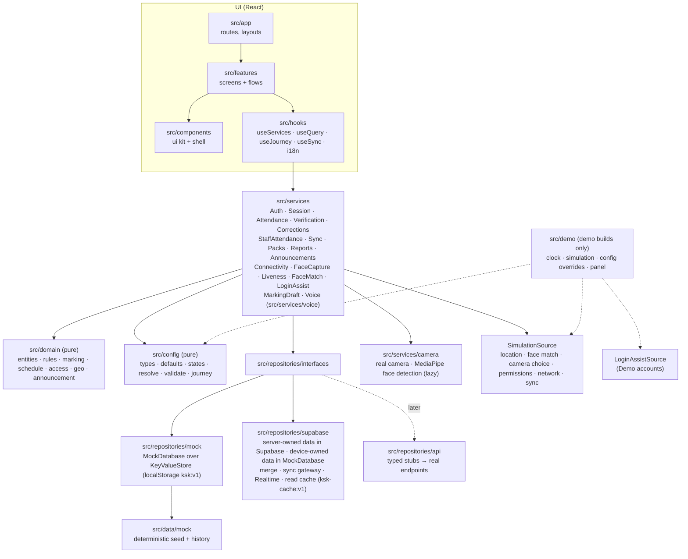
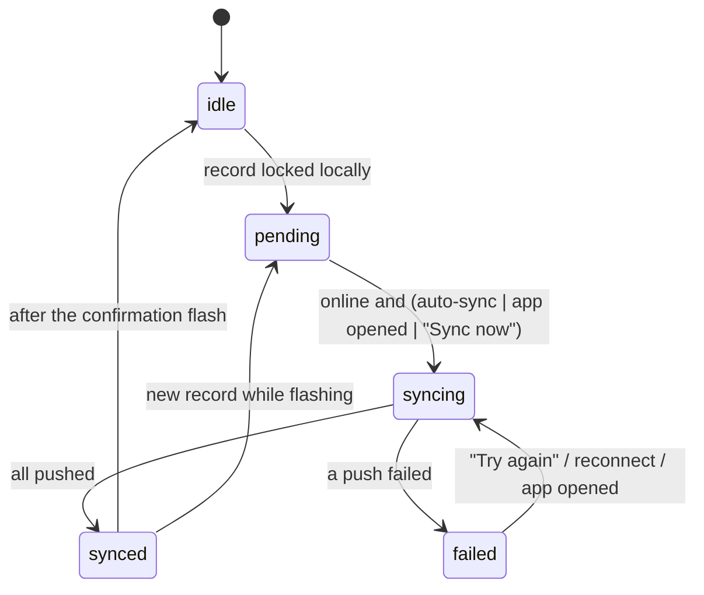
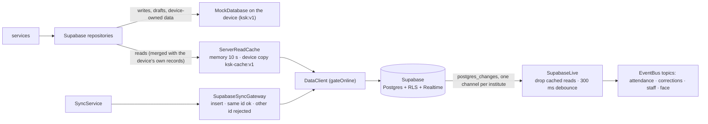
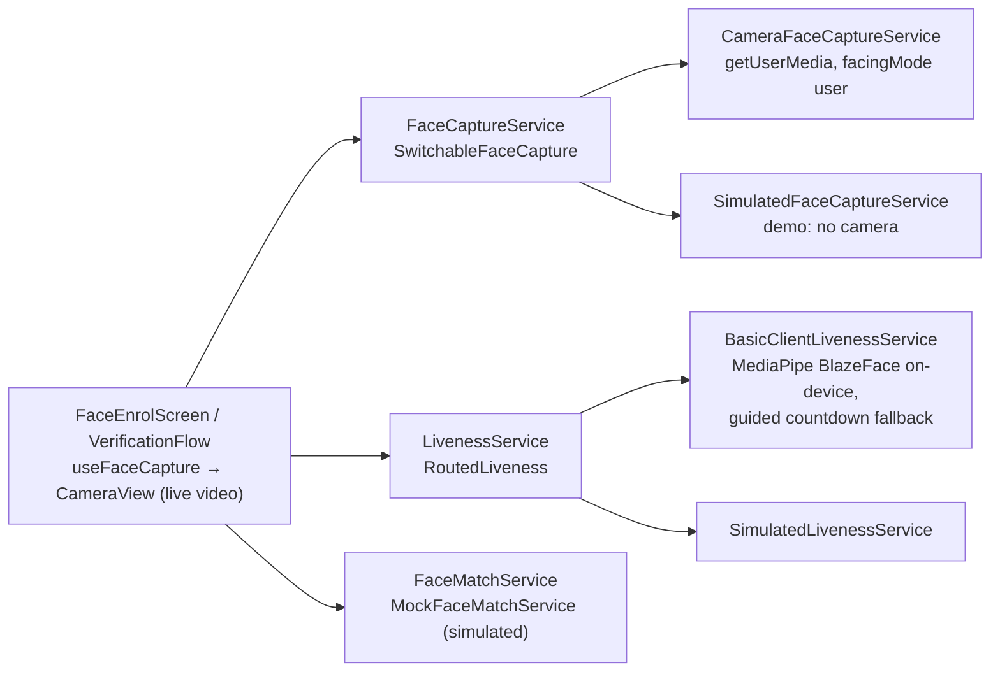
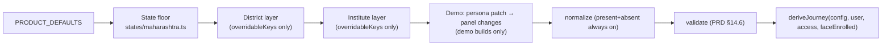

# Architecture

## Shape of the app

This is a **client-first, offline-capable** Next.js 16 App Router app. Every route is prerendered as a static shell, and all data work happens in the browser through services. There are no Server Actions in v1, and exactly one route handler, `POST /api/voice/token`, which only mints a Voice Agent token (see Voice Agent below). Data comes from one of two sources behind the same repository interfaces (D-143): the on-device mock, whose "server" runs in the browser, or the shared Supabase project, which the browser reads and writes directly with the publishable key. Either way the app deploys to Vercel as static files plus that one function, and everything except Voice Agent works without it; on Supabase, records are saved on the device first and pushed when online.



Dependency rules are enforced in `eslint.config.mjs`:

| Layer | May import | Must not import |
|---|---|---|
| `src/app`, `src/features`, `src/components`, `src/hooks` | hooks, components, services' **types**, domain, config types, i18n, lib | `@/data/*`, `@/repositories/mock|api|supabase`, `@supabase/*`, `@/demo/*`, `@/server/*`; `journey.isPrincipal` |
| `src/services` | domain, config, repository interfaces, lib | mock data, the Supabase layer and demo code (only `container.ts`, the composition root, wires the mock and Supabase repositories) |
| `src/repositories/supabase` | repository interfaces, the mock repositories (for device-owned data), domain, lib | UI, services. Only `client.ts` imports `@supabase/supabase-js`; `src/app-shell/boot.ts` loads it by `import()` for the Supabase source only |
| `src/domain`, `src/config` | each other, lib | React, Next, services, repositories, hooks, components |
| `src/domain/voice` | domain, config, lib | everything else; no `Date.now()` or `new Date()` by convention (not lint-enforced: clocks and timestamps are passed in) |
| `src/server` (voice token mint, guards) | `@google/genai`, lib | React, hooks, components, features, services, demo code, mock data, mock repositories. Only `src/app/api/**` may import it, and no other layer may (container, lib, domain and services included) |

## Boot sequence

```mermaid
sequenceDiagram
  participant L as RootLayout (static)
  participant P as AppProviders (client)
  participant B as bootApp()
  participant C as createMockContainer | createSupabaseContainer
  participant S as SessionProvider
  L->>P: render; BootSplash until ready
  P->>B: useEffect → bootApp() (cleanup: container.dispose())
  alt NEXT_PUBLIC_DEMO_MODE === 'true'
    B->>B: import('@/demo/adapters') + import('@/demo/controller') → DemoClock (+ systemClock as wallClock), DemoSimulationSource, DemoConfigOverrides, DemoLoginAssist
  else demo off
    B->>B: systemClock (clock and wallClock), StaticSimulationSource, real connectivity + Geolocation
  end
  B->>B: resolveDataSource(env); demo: the Data choice "This device" keeps the mock
  B->>C: store(ksk:v1), prefs(ksk-prefs), clock, simulation, overrides, loginAssist (+ Supabase client, cache ksk-cache:v1)
  C-->>B: { repositories, services, bus, clock, simulation, dataSource }
  B->>B: demo + Supabase only: prepareSharedDemo (seed today's story once a day, wait at most 8 s)
  B->>B: demo only: loginAssist.connect(prepareScenario), demo repo subscription (both released by container.onDispose)
  B->>B: sync.start() (listens to connectivity; sends leftover queue if online)
  P->>S: ServicesProvider → I18nProvider → SessionProvider → ToastProvider
  S->>S: session.load() → SessionContext { user, institute, config, access, journey, data, clock, wallClock }
```

`SessionContext` (`src/services/context.ts`) is the snapshot every service call receives: who the user is, their institute, the **resolved configuration**, their **access scope** (which trades and batches they can reach), the **journey** (which steps and controls exist), master data, and the clock. When the configuration changes (in the demo panel), the session reloads and every query refreshes.

**Two clocks (D-151).** `ctx.clock` is the app clock: batch windows, cards, rules, dates and the self-pass reuse age read it (the demo clock, 10:15 by default, in a demo build). `ctx.wallClock` is the real time of day and is read **only for greetings**: Home's greeting (`greetingKey`, refreshed by a minute tick while Home is open) and Voice Agent's spoken greeting (`greeting.ts`), both through `dayPart(instant)` in `src/lib/time.ts` (IST: morning 05:00–11:59, afternoon 12:00–16:59, evening 17:00–20:59, night 21:00–04:59). Demo builds pass the device's `systemClock` as `wallClock`; production passes the same clock as `clock` (`MockContainerOptions.wallClock`, omitted means `clock`); tests pass a fixed one.

**Container lifetime (D-158).** `AppContainer.dispose()` stops everything that keeps a container live, once, in order, and a release that throws does not stop the rest (`src/services/lifetime.ts`): the sync loop (`sync.stop()`), a running voice session (`VoiceService.dispose()`), the source's own release (on Supabase, the Realtime channel and the face-flag connectivity listener) and whatever boot registered with `onDispose` (the demo repository subscription, the login-assist connection; a release registered after a dispose runs at once). A second call does nothing. `AppProviders` disposes the runtime its effect booted, including a boot that resolves after the cleanup (Strict Mode boots twice in dev). Its first line is `// @refresh reset`, so when Fast Refresh re-runs it (any edit in services, repositories, config or domain) the composition root remounts and builds a new container instead of keeping old instances; component-only edits keep normal Fast Refresh. This was verified under Turbopack, so there is no reload fallback.

## Data flow in the UI

- `useServices()` returns the service instances. Screens never touch repositories.
- `useQuery(key, fetcher, topics)` is a small stale-while-revalidate hook. It re-runs when its key changes or when a repository emits one of its `topics` on the `EventBus` (`session`, `config`, `attendance`, `corrections`, `staff`, `face`, `verification`, `offline`, `packs`, `preferences`, `demo`). It keeps the last data while refreshing, so lists never flash empty.
- `useSyncStatus()` subscribes to `SyncService` through `useSyncExternalStore`.
- Translated strings are produced at render time (`useI18n()`). Services return data, not copy.

## Routing

All pages are static (the one route handler, `POST /api/voice/token`, is dynamic). IDs travel in the query string, so every page can be prerendered and a soft navigation needs no server round trip:

| Route | Screen |
|---|---|
| `/` | Entry redirect (session → `/home`, else `/login`); `?preset=` applies a demo preset |
| `/login`, `/login/institute`, `/login/trainer`, `/login/identity` | Institute code → confirm → Trainer ID → confirm |
| `/face?next=` | Face registration (real camera, prototype movement check, simulated matching), then continue to `next` (validated by `safeNext`) |
| `/home` | Instructor home (notices, today's classes in the mapping model's shape, my attendance, submitted today; My attendance moves to the top while own attendance comes first, D-152), or the institute overview for the principal |
| `/attendance` | The principal's institute board (Students / Staff switch). Without the Attendance tab it redirects to `/home` (D-052) |
| `/attendance/trade?trade=` | One trade's batches |
| `/attendance/open?s=` | Gateway: permission primer → verification (or a reused self check, D-152) → roster, or a problem screen ("Mark your attendance first" while own attendance comes first) |
| `/attendance/mark?s=` → `/review?s=` → `/submitted?s=` | Roster, review (the one confirmation: Submit saves at once, a double tap saves once, D-149), result |
| `/attendance/record?s=` | Read-only record of the session it was opened for (principal: correction entry points). No Today / Yesterday switch; a typed past-date URL renders read-only (D-150) |
| `/attendance/correct?s=&student=` | Principal correction with reason |
| `/attendance/staff` | Principal staff marking |
| `/me/attendance` | Self attendance |
| `/reports` | This month's report sections (D-053) |
| `/reports/view?r=&range=` | Detail report with range switch and print view: `staff_summary` or `correction_log` |
| `/voice/diagnostics` | Hidden microphone, speaker and AudioContext checks for a device or WebView; no navigation entry; redirects Home where voice is off (instructor or principal, D-139) |
| `POST /api/voice/token` | The only server endpoint: a single-use Gemini Live token (D-078). Dynamic (`ƒ`); everything else is static |
| `/reports/offline`, `/reports/offline/download` | Offline data and download batches, opened from Reports, for every user while offline is on (D-056, D-153); without `journey.offline.packs` it is the sync status only and the download route redirects. `next.config.ts` redirects `/profile/offline*` here, and `/profile` to `/home`: profile is a menu, not a page (D-046) |

`s` is a **session key**: `batchId.date.slot[.subjectId]`, for example `ele-s1u2.2026-09-25.daily`, `ele-s1u2.2026-09-25.p3` or `ele-s1u1.2026-09-25.daily.es`.

## Screen frame, header and navigation (responsive)

**Mobile-first is not a fixed mobile viewport (D-045).** Phones are the primary design; from the SwiftChat medium breakpoint (600px) up, the same screens fill the viewport and keep a readable column instead of a 412px phone frame.

- `ScreenLayout` (`src/components/shell`) is every screen's frame: header → connectivity banner → optional fixed `top` → `main` (the only scroller) → dock (toast, footer, bottom nav). The dock element is registered with `DockInset` (below). Props that matter for layout:
  - `width`: the content measure from 600px up — `form` 480px, `reading` 800px (roster, review, records, reports, staff), `wide` 1008px (home, class lists). Phones always use the full width.
  - `card`: from 600px up the whole screen becomes a centred form-width card on the page grey (login steps, face intro, permission primers, result and stand-alone problem screens), with the action directly under the content.
  - `area` + `bottomNav`: which destination the screen belongs to (marked current in both navigations) and whether it is a tab root (bottom nav on phones). Class-marking task screens get their `area` and back target from `useAttendanceRoot()`: Attendance where that tab exists, otherwise Home (D-052).
  - `guardNavigation`: lets a screen with unsaved work intercept header / bottom navigation (the principal's unsaved staff marks).
  - `top`: the fixed region above `main`; every screen that has one wraps it in `TopBand` (one anatomy: white, one bottom divider, 12px padding on the column, D-159).
  - `footerDivider`: a top divider on the footer (the first login screen while its Demo accounts list scrolls under it).
- Gutters are CSS custom properties on the frame (`--gutter-inline`, `--gutter-flush`, `--gutter-footer`, `--gutter-wide`), computed as `max(page margin, (100% − column) / 2)`. The `100%` resolves where each is used, so full-bleed bars (header, banner, footer, summary strips) keep their backgrounds while their content lines up with the column. Use them only on the frame's full-width children: inside `main` (which already applies the gutter), content uses its own 16px. Page margins follow the DS grid (16 / 36 / 64px), and two-column grids use `--page-gutter` (20 / 36 / 36px).
- `main` is the only scroller, and none of its direct children may shrink (`.main > * { flex-shrink: 0 }`), or lists with `overflow: hidden` clip their own rows.
- `inlineFooter`: from 600px, the footer follows the content instead of docking at the bottom edge. It is used for problem and confirmation screens inside the app, so their one action isn't a monitor-height away.
- **The Voice Agent widget and the dock (D-147).** `VoiceFloat` is one viewport overlay, portaled to `<body>`, at the bottom-right corner; it never changes a screen's layout and reads only one thing from the screen: its dock. `ScreenLayout` registers the dock element with `registerDock` (`src/components/shell/DockInset.ts`; the last mounted screen wins, and a screen unregisters only if its dock is still current). `useDockInset(float)` measures how far the widget lifts (`dockInset()`, pure): a dock that ends at the viewport's bottom edge (a footer band, the bottom navigation) always lifts it by the dock's height; a dock that follows the content (an inline footer, a centred card) lifts it only when the widget's corner box would meet one of the footer's actions (8px apart). It re-measures when the screen's column or any part of it, the float or the window resizes, and when `html[data-demo-drawer]` or `html[data-demo-float]` changes; it writes only on a change and keeps the last value between two screens, so the widget does not dip on a navigation. `VoiceFloat` writes the result as `--float-dock`, sets `html[data-voice-float]` and `--voice-float-height` (its measured height) so the scroller keeps `--voice-reserve-block-end` of room, and moves left of the open demo drawer.
- **One header: `AppHeader`** (`src/features/shell/AppHeader.tsx`) on every signed-in screen with chrome. Phones: a single 60px bar — the KSK brand on tab roots, back + screen title on task screens — with the avatar at the top right. 600px and up: a full-width bar (brand · primary navigation · avatar) aligned to the wide column, plus a context row (back + title) aligned to the screen's column. Immersive single-task steps (camera capture, permission primers, result screens) have no chrome, as in the prototype.
- **Header tool slot** (`src/components/shell/ToolSlot.tsx`): `AppHeader` always renders an empty `display: contents` span in its trailing group, immediately left of the avatar, for tooling outside the product. The demo trigger portals into it (D-057, D-066). The product never puts anything there, and the avatar stays the right-most control.
- **Navigation** (`src/components/shell/AppNav.tsx`) renders the journey's `navTabs` twice: the DS bottom navigation on phones (tab roots only), and a compact row in the header from 600px up. `deriveJourney` decides the tabs: Home always; Attendance only for the institute board (`access.selection === 'institute'`, the principal); Reports when a report block is enabled or offline data is on. Instructors see Home · Reports, the principal Home · Attendance · Reports (D-052). Never a sidebar. Profile is not a destination.
- **Profile menu** (`src/features/profile/ProfileMenu.tsx`): the avatar opens a native `<dialog>` — a bottom sheet on phones, a menu anchored under the avatar on wider screens. Identity (name, role, institute, Trainer ID), language, face registration status, help, logout. It is the single profile entry point.
- Grids go to two columns only where each card still reads at a glance (class cards, the trade list, the principal's two status cards, home's trade overview + My attendance pair), all at 640px of column through one container query (`@container (min-width: 640px)`, D-159). Never more than two.

## Where the rules live

| Rule | Pure policy | Enforced by |
|---|---|---|
| Submit once, then locked (INV-01/03) | `checkSubmission` → `already_submitted` | `AttendanceService.submit`; `MockAttendanceRepository.createSubmission` does an atomic check-and-set; `saveDraft` refuses after submit |
| No backdating (INV-05/06) | `checkSubmission` / `checkCorrection` → `not_today` | every write path |
| Hard time fence, no grace (INV-20) | `windowState` → `window_not_open` / `window_closed` | `openRoster` and `submit` |
| Verify before the list (INV-16) | `VerificationService.hasPass` | `openRoster` and `submit` require a pass for (user, session, today) |
| Blank default: every row marked; half-day half and leave type chosen | `completenessIssues` → `incomplete` | `submit`; roster footer explains what is missing |
| Principal-only, same-day, reason, real change, not OJT, synced first | `checkCorrection` | `CorrectionService.correct`; corrections are append-only |
| One staff mark per person per day; self precedence | `checkStaffMark` | `StaffAttendanceService`; principal batch-save returns `{ saved, skipped }` |
| Access scope | `resolveAccess` / `canMarkBatch` | `openRoster` and `submit` → `no_access` |
| Own attendance before students (D-152) | `checkSelfFirst` → `self_first` (while `journey.staff.selfFirst`, which is `staff.selfBeforeStudents` and the user can self-mark, and the user has no own staff record today; a principal's mark counts) | `AttendanceService` reads the own record once per board or card lookup and sets `selfFirst` on each open, markable card; `openRoster` refuses `self_first` (the gateway shows its problem screen), and `submit` passes it to `checkSubmission`. Home and the batch rows only explain it. Voice: `select_batch` and `select_trade` answer `SELF_FIRST` (`handlers/select.ts`), as does a submit that meets `self_first`, and `executor-start.ts` asks for own attendance first; both read the own record themselves. The principal never has self attendance, so is never blocked |
| One check, not two (D-152, amends D-028) | `canReuseSelfPass` (a `self` pass from today, no older than `verification.selfPassReuseMinutes` by `ctx.clock`, whose stored `checks` cover every check the batch needs) | `VerificationService.reuseSelfPass` grants the session pass and emits `granted` as a normal pass does; the gateway (`useVerification`) calls it before running any check ("Verified a moment ago"), and voice's `select_batch` when the batch has no pass yet. A pass without `checks` is never reused; 0 turns it off. INV-16 holds: the roster still needs a session pass |
| Disabled means absent | `deriveJourney` | UI renders from the journey; services skip geo/face calls when off |
| Voice: confirm before submit, bulk marking, a staff mark and "everyone else" (`mark_remaining_staff`, a code bound to the exact unmarked set, D-156); OJT locked; names only after verification; one live draft; own mark only after the pass | `issueConfirm`/`checkConfirm` (`src/domain/voice/confirm.ts`), `MarkingDraftService.setMark` | the voice executors, over the same `AttendanceService`/`VerificationService`/`StaffAttendanceService` checks as taps (D-082, D-084, D-086, D-141) |

Errors are typed `Result` values (`src/lib/result.ts`). Services throw only for programmer errors or `NotImplementedError`.

## Offline and sync

Every write (online or offline) takes the same path. The record is **stored and locked on the device first**, then queued, then pushed.



- `SyncService` (`src/services/sync.ts`) owns the state machine. It is exposed through `ConnectivityBanner` (offline / syncing / failed + Try again / synced), the `SyncPendingCard` on Home and Offline data (D-064; those screens limit the banner to "offline" with `banner="offline"`), and Reports → Offline data (`/reports/offline`). `SyncStatus.lastFailure` (`{at, trigger: 'auto' | 'manual'}`) is kept until an attempt succeeds: automatic triggers call `syncNow('auto')`, a tap calls `syncNow()`.
- Offline marking needs a **downloaded batch pack** (`BatchPackService`). A pack older than `offline.refreshDays` shows a "may be missing new admissions" warning on the roster. Packs refresh all at once (`refreshAll`, PRD §20.3) or one batch at a time (`refreshBatch`, from its card or its Offline data row, D-055). Both only re-stamp the roster: drafts and records waiting to sync are never touched.
- **Offline for every user (D-153).** Two journey flags decide it: `journey.offline.enabled` is `offline.enabled` for everyone, the principal included, and `journey.offline.packs` is offline on and the user may mark students (for the principal, `identity.principalCanMarkStudents`). `BatchPackService` downloads and refreshes only a batch the user can mark online and only with packs (`inScope`, `mayChange`; INV-25), so hiding the screen is never the only guard. Without packs, Offline data is the sync status only (its Reports entry reads "Sync status") and `/reports/offline/download` redirects. Offline staff marks and corrections are saved on the device and queued like any record; the staff save says "Saved on this phone · will sync automatically" when the marks did not sync at once.
- **The waiting list.** `SyncService.pendingItems()` returns `PendingSyncItem`s (kind, record id, label, time): the queue's retriable items, then the outbox's items of kind `'correction'` (`SyncOutbox.pendingItems?()`, in send order), so the list matches the pending count. Offline data names each one: "My attendance" for the user's own staff record, "Staff attendance · {name}" for a mark made for someone else, "Correction · {student}" for a correction waiting in the Supabase outbox (the mock never has one pending). Packs and the queue are per device, not per user.
- The principal's view shows only what has reached the server. An unsynced record cannot be corrected (`not_synced`).
- **On the Supabase source** the same path pushes to Supabase through `SupabaseSyncGateway` (next section). A push the server refuses for good (`rejected`: someone else submitted that session first) is final: `SyncService` records `lastError: 'rejected'`, marks the record `rejected`, stops pushing it and leaves it out of the pending count and `pendingItems()`. `SyncService` also takes an optional `outbox` (`SyncOutbox`: `pendingCount()`, `flush()`; the container passes the Supabase corrections repository): its count is part of `status().pending`, every sync (Sync now included) drains it after the queue, it drains at start when online and on reconnect, and a sync that leaves it non-empty ends `failed` (a failed phase with nothing pending shows as idle, `settleDrained()`); `outboxCount()` is public for the demo's Data switch.
- Real offline navigation in a WebView would need a service worker for the static shells. That work belongs to production hardening, not this build.

## The Supabase data layer (D-143, D-144)

`src/repositories/supabase/*` implements the repository interfaces on the shared Supabase project (`docs/SUPABASE.md`). The UI never imports it; `container.ts` wires it in `createSupabaseContainer`, and `AppContainer.dataSource` says which source is live (`'mock'` or `'supabase'`).



- **Who owns what.** Server-owned: master data (institutes, trades, subjects, batches, students, staff, timetable, OJT), announcements, submissions, corrections, staff attendance, voice minutes and face-enrolment flags. Device-owned, in both sources: drafts, the offline queue, batch packs, verification passes, the session and preferences. In the Supabase mode the device database does not seed the server-owned demo story (`MockDatabase` option `seedServerData: false`); its packs are the device's own downloads, except that in demo builds a first seed, Reset and every preset write the story's packs (the `demoStoryPacks` option, which only the demo boot path in `boot.ts` sets, and `MockDatabase.restoreStoryPacks()`, called by the demo controller's `prepareScenario`); a demo-off Supabase build starts with none. Switching the source reseeds the device and signs out, and the demo panel refuses it while records wait to sync.
- **The seam.** `DataClient` (`data-client.ts`: `select`, `insert`, `upsert`, `remove`, `rpc`, `subscribe`) returns results as values and never throws: `network` means try later, `server` carries the Postgres or PostgREST code (23505 unique, 23503 missing parent). `gateOnline` answers `network` without a request while the device is offline, so the demo's network switch reaches it. `client.ts` is the only SDK import: auth is off (the publishable key is the only credential), one SDK client per page, reads page through PostgREST's 1000-row limit, each request has a 10 s timeout and no SDK retries, and status 0, 408, 429 and 5xx count as `network`. Each Realtime subscription gets its own topic, because the SDK client is shared per page. `mappers.ts` maps rows to domain types and normalises timestamps (`+00:00` → ISO).
- **Writes are offline-first.** `SupabaseAttendanceRepository` and `SupabaseStaffAttendanceRepository` write through the device repositories with the same write-once checks, then the existing `SyncService` pushes. `SupabaseSyncGateway` inserts; on 23505 it looks the row up: the same id is success, a different id is `rejected`, which is final (the device keeps its record, never pushes it again, and the server's copy wins). A network failure, and any other refusal (RLS 42501, a missing parent 23503), is retried, so a set-up problem fixed on the server clears itself. Corrections (`corrections.ts`) are appended on the device and sent at once through an outbox in the device store (written before the device copy), again at start, on reconnect, with every sync and after a submission push, re-reading the outbox after each send; a 23503 keeps one waiting while its submission waits on this device and otherwise refuses it (a refused list, `refused()`), a 23505 counts as delivered; delivered and read-back ids are remembered (`seen:corrections`) so only corrections the server had can be pruned. `all()` lists the server's corrections by (timestamp, `seq`, `correctionId`), then this device's outbox in the order made. Shared rows pass through `validate.ts` (pure): invalid marks, slots, reason codes, staff statuses and announcement fields are dropped and invalid rows skipped.
- **Reads merge.** `mergeRecords` (`merge.ts`): a device record still waiting to sync (`awaitsSync`: pending or failed) wins for its key; otherwise the server's copy wins; a device record the server lacks still shows. `mergeLive` adds the prune rule: after a live answer (`ServerReadCache.readLive()` returns `{ value, live }`; a cached or device copy is not live), a *synced* device record of the signed-in institute (filtered first by `inScope(ctx, local, member)`, from `SupabaseContext.members`, the institute's batches and staff) that the answer lacks is dropped and removed from the device database (submissions, staff marks, corrections), so a session reset on the server can be submitted again; pending, failed and rejected records are never dropped. A rejected device record shows only while the server copy cannot be read, with the "Not saved" warning. One query per day serves every `getSubmission` on a screen; date ranges are their own queries.
- **The read cache.** `ServerReadCache` (`read-cache.ts`) keeps answers fresh for 10 s of real elapsed time (never the demo clock), shares concurrent reads of one query, and keeps the last good answer per query on the device (`ksk-cache:v1`, at most 24 queries, oldest dropped first). A network failure answers silently from that copy; a server refusal throws (a bug, not an expected condition). Master data is one load per institute per day; its device copy and the institute-code lookup are pinned, so an offline phone can sign in on a new day. A day change keeps the queue, unsynced records, the device's corrections, downloaded packs and waiting face flags.
- **Realtime.** `SupabaseLive` (`live.ts`) follows the session (sign-in, restore, sign-out) through a session-store wrapper and subscribes to submissions, corrections, staff_attendance and face_enrolment filtered by `institute_id`. A change drops that table's cached reads at once and, after a 300 ms debounce, emits the mapped topics once per burst: submissions → `attendance`; corrections → `corrections` and `attendance`; staff_attendance → `staff`; face_enrolment → `face`. Screens refetch through `useQuery`.
- **Other repositories.** Voice minutes read max(server, device) and upsert `(staff_id, date)`; face enrolment saves the device copy first and keeps a face outbox until the upsert succeeds (flushed at start and on reconnect); a live read prefers the server (a device copy not waiting to be sent is dropped when the server has none), otherwise the device copy answers; a removal deletes the server row first and keeps both copies if that fails.
- **Demo on Supabase** (`src/demo/supabase-seeder.ts`, demo builds only). On boot, `prepareSharedDemo` reads `demo_meta.seeded_day`; if it is not today, it builds the payload from the app's own generators (missing history of the last 45 days, today's story, yesterday's correction with a day-scoped id, OJT, announcements, face flags) and calls `ksk_seed_day` once, waiting at most 8 s. Seeding is idempotent, so two devices racing is harmless. "Reset shared demo data" calls `ksk_reset_demo`, then seeds again. Both need the SQL functions of D-144.

## Face capture, liveness-style check and matching (D-048)

Three separate seams, so a production provider can replace each without touching screens:



- **Camera (real).** `CameraFaceCaptureService` opens the front camera with `getUserMedia({ video: { facingMode: { ideal: 'user' } } })`. The preview is mirrored with CSS only; frames are not. A capture draws the current video frame to a canvas (longest side 640px) and makes an in-memory JPEG `Blob`. The stream is stopped when the screen unmounts. `getUserMedia` failures map to `permission_denied`, `not_found`, `busy`, `unsupported`, `failed` (legacy WebView names included), each with its own problem screen.
- **Movement check (prototype).** `BasicClientLivenessService` loads MediaPipe Tasks Vision **0.10.35** (pinned: 1.0.x posts usage metrics to a Google endpoint with no opt-out, D-049) by dynamic `import()` only on face screens. The wasm runtime is copied from `node_modules` to `public/vendor/mediapipe/<version>/` by `scripts/vendor-mediapipe.mjs` (runs before `dev` and `build`); the BlazeFace short-range model (Apache-2.0, 229,746 bytes, SHA-256 `b4578f35…152f`) is in `public/models/`. Both are served from this origin with a one-year immutable cache. The CPU delegate is used (faster than GPU for this model; avoids known Android WebView GPU failures). About 3.5 MB gzipped on first use, then cached.
  - Rules are pure and unit-tested (`src/services/camera/liveness-rules.ts`).
    - **What each frame must show:** one face (score ≥ 0.7; a second face ≥ 0.5 blocks), sized 28–65% of the preview's short side, with keypoints inside the visible preview and near the oval (a landscape webcam is judged inside its portrait crop), and brightness ≥ 40/255.
    - **Straight:** "Face detected", then "Hold still" for 8 steady frames at |yaw ratio| ≤ 0.10.
    - **Turn left, then turn right:** 3 frames at ≥ 0.18 (about 16°). The head must pass back through centre, or reach the other side, between turns. Eye distance must stay ≥ 75% of frontal, so moving away isn't a turn, and a turn that is too far asks "Turn back a little".
    - **Mirrored cameras:** a steady opposite turn for 1.5 s at the first turn is taken as a mirrored camera.
    - **Guidance** changes only after holding for 2 frames.
    - **Timeouts:** the check gives up after 60 s (registration) or 30 s (daily) and names the dominant reason: too dark, several faces, face not seen, wrong distance, not in the oval, or head turn not seen.
    - **Camera failures:** a preview that never starts, or a camera track that ends, is reported as a camera failure. If the WebView blocks playback without a gesture, a "Tap to start the camera" button appears.
  - **Fallback:** if WebGL is missing, the runtime or model can't load within 12 s, or detection throws, the same steps run as guided captures with a visible 3-2-1 countdown. After two failed checks on a screen, the next attempt is guided too; on the daily check they also count towards `faceRetryLimit`. The demo can force this ("Face detection: Guided only").
  - **What it is not:** production liveness. A printed photo moved by hand or a replayed video can pass it. It checks presence and head movement only.
- **Matching (simulated).** `MockFaceMatchService` never compares faces. Enrolment records `{ staffId, enrolledAt, sampleCount, simulated: true }`; the photos are dropped. Verification returns the demo panel's outcome. Every face screen says "Prototype · photos are not saved · face matching is simulated" while `faceMatch.simulated` is true.
- **Privacy.** Photos live in memory for the current screen only (thumbnails are object URLs, revoked on unmount; a photo that finishes after the screen closed is dropped). `camera.spec.ts` asserts three things during a real-camera registration: nothing image-like in localStorage or sessionStorage, no IndexedDB database, and no request other than same-origin GETs for app files.
- **WebView host requirements.** SwiftChat must grant `RESOURCE_VIDEO_CAPTURE` in `WebChromeClient.onPermissionRequest` (and hold the Android CAMERA permission), allow inline media playback, and load the app over HTTPS. Voice Agent also needs `RESOURCE_AUDIO_CAPTURE` granted there, and the app must hold the Android `RECORD_AUDIO` permission (see Voice Agent). Otherwise the page sees `NotAllowedError` (shown as "Camera access is blocked", or for voice "Microphone is blocked"). `next.config.ts` sends `Permissions-Policy: camera=(self), geolocation=(self), microphone=(self)`.
- **Production boundary.** Replace `MockFaceMatchService` (and `BasicClientLivenessService`) with a certified provider behind the same interfaces: server-side or on-device matching, certified presentation-attack detection, consent and a retention policy set by the state. The screens need no change; the "prototype" labels disappear when `faceMatch.simulated` is false.

## The register pipeline (D-137)

The monthly attendance register is built in three steps, each pure except the first:

1. **Service.** `ReportService.registerMonths(ctx)` offers this month and last month; `ReportService.register(ctx, { batchIds, month })` waits the simulated delay, reads the clock once, checks that the month is offered and every batch is in the report scope (otherwise `null`), and collects each batch's records and corrections with the leaderboard's own query. The orchestration (offered months, the scope check, one clock reading, the builder's inputs) lives in `src/services/report-register-service.ts` (`registerMonthsFor`, `monthlyRegister`); `ReportService` keeps the public methods and hands over its scope, its `trade()` lookup and its record reads.
2. **Pure builder.** `buildRegister` (`src/services/report-register.ts`) lays out every day of the month (`class`, `none`, `pending` today, `upcoming`) and each student's cells (statuses after corrections, a day share, a corrected flag), totals, at risk, the corrections (actor name and roll number) and the instructor who marked most. The arithmetic is shared with the leaderboard in `src/services/report-math.ts` (presence weight, a day of several sessions counts once, threshold-safe rounding, at risk needs `atRiskMinDays`), so the figures agree with the screen.
3. **Document and download.** `registerDocument(register, options)` (`src/features/reports/register/*`: `registerDocument`, `registerParts`, `registerTable`, `registerStyles`, `escape`) returns one self-contained HTML string: a CSP of `default-src 'none'` with one hashed inline print script, the emblem embedded once as a data URL (`brandLogo.ts` fetches `/branding/ksk-emblem.png`), every dynamic string escaped, A4 landscape print rules; quick correction reasons are printed from `reasonCode` in the document's language (`correctionReason()`), free text as typed, and the month label comes from `format.monthYear`. `registerFileName` gives the ASCII name. `RegisterDownloadSheet` asks for the month and calls `saveTextFile` (`src/lib/download.ts`: Blob, `<a download>`, URL revoked after 30 s). Inside an embedded Android WebView (`isEmbeddedWebView`, `src/lib/platform.ts`) nothing is built and a toast explains. The register document uses its own print palette, not the app's tokens: it is a standalone file opened outside the app.

## The staff report (D-154)

The principal's Staff attendance section on Reports (after At-risk, before Offline data), the staff detail report and the staff register share one set of rules:

1. **Pure builder.** `buildStaffOverview` (`src/services/report-staff.ts`) works over this month to date: the institute's staff-days are the dates up to today with at least one staff record (there is no holiday calendar, so a day nobody was marked counts as closed); a person's unmarked days are staff-days before today with no record of theirs, shown apart and never counted as absent; today is reported apart; % is present weight (present and OJT 1, half day ½) over marked days, with the threshold-safe rounding of `report-math.ts`. Office staff are left out and the principal is in. `order` (lowest % first, then more unmarked days, then name) is the list's order everywhere. `reports.staffThresholdPct` (default 90) marks a low %.
2. **Scope and service.** `staffReportInScope(ctx)` (the principal's staff view and the `staff_summary` block, never a role check) guards `ReportService.staffOverview(ctx)` (null outside it), `staffSummaryFor` (the detail report, in the same order; empty outside it) and the register. `ReportService` only delegates; the types are in `report-types.ts`, re-exported by `reports.ts`. While the section shows, the Institute card drops its staff figure and More reports keeps only the Correction log.
3. **Staff register.** `buildStaffRegister` and `staffMonthlyRegister` (`src/services/report-staff-register.ts`, behind `ReportService.staffRegister`) lay out the month by the same rules, and `staffRegisterDocument.ts` renders it with the register parts (same CSP, emblem once, escaping, A4 landscape). The section's "Staff register" opens `RegisterDownloadSheet` with the `{ kind: 'staff' }` scope, under `reports.pdfDownload`.
4. **Voice** reads the same builder: `get_staff_report`, and the staff figure in `get_reports_overview`; `show_staff_report` and `open_staff_register` are bus events owned by `StaffSection`.

## Location: real or simulated

`LocationProvider.currentPosition` returns a `DevicePosition` with `source: 'device'` (`BrowserLocationProvider`, the Geolocation API) or `source: 'simulated'` (`SimulatedLocationProvider`, the demo's chosen outcome). The source is kept on the captured location (`CapturedLocation.source`) for audit and is never shown to instructors. Demo builds simulate by default; the panel's "Real GPS" defers to the device. Demo-off builds always use the device.

## Voice Agent (D-078 to D-159)

An instructor or the principal taps the floating **Voice Agent** button (one overlay at the viewport's bottom-right corner on every signed-in screen where voice is on, D-133, D-139, D-147) and talks, in English or Marathi (D-080). For an instructor the agent follows the configured marking flow: trade (when the mapping model has one), batch or period, the location and face check, marking (roll call or by exception), review and submit, reading only sessions that can be marked now (D-134). Beside marking, and for the principal instead of it, the agent answers reports and insights questions, marks own or staff attendance, reads announcements and opens screens, as far as the capability plan allows (D-139 to D-141). Corrections stay tap-only. Taps and voice work on the same draft; the screen follows the conversation; the tap UI is untouched when voice is off, blocked or broken.

```
Browser (SwiftChat WebView)                                         Google
+--------------------------------------------------------------+
| features/voice: VoiceProvider . VoiceFloat (button + card)   |
|   useActionBus (router, end) . useScreenSync (route -> flow) |
|                |                         ^                   |
| services/voice v                         | UI events         |
|   VoiceSession -- executor -- ActionBus -+                   |
|     |  |  +-- handlers -> AttendanceService / Verification   |
|     |  |       MarkingDraftService <-- taps . Reports .      |
|     |  |       Announcements . StaffAttendance               |
|     |  +-- audio: recorder (worklet 16 kHz) . player 24 kHz  |
|     +-- LiveTransport ---- WSS (token) ----------------------+--> gemini-3.8-live
|          (geminiTransport | ScriptedLiveTransport, demo)     |
+---------------+----------------------------------------------+
                | POST /api/voice/token (same origin)
+---------------v------------------+
| Next Route Handler (Vercel Fn)   |-- authTokens.create (GEMINI_API_KEY) --> Gemini API
| Origin check . rate limit .      |
| VOICE_DISABLED kill switch       |
+----------------------------------+
```

| Layer | Voice code | Rule |
|---|---|---|
| `src/domain/voice` | `types`, `text`, `phrase`, `match`, `lexicon` (matching), `plan` (`compileVoicePlan`: the marking flow plan beside the capabilities, D-139), `flow` (step machine, `advance()`), `confirm` (tokens, including `mark_staff`) | Pure TypeScript: no React, Next, services or clock |
| `src/services/marking-draft.ts` | `MarkingDraftService`: the live draft behind taps and voice | Services and repository interfaces only |
| `src/services/voice` | `tools`, `prompt`, `prompt-capabilities`, `instructions`, `instructions-core`, `app-events`, `labels`, `overview`, `report-texts`, `staff-texts`, `screens`, `greeting` (the app-filled first line, D-151) and `kickoff` (the first-turn texts): model-facing text and the nav targets; `executor` (marking), `executor-overview` (no marking flow) and `executor-start` (which first turn: own attendance first, D-152), `handlers/` (`base`, `context`, `select`, `marking`, `review`, `submit`, `status`, `events`, `capabilities`, `reports`, `staff-report`, `self`, `staff`, `check`), `action-bus`, `usage` (caps), `session` (+ `session-swap`, `session-tools`, `session-taps`, `session-outbox`, `session-mic`, `session-cues`, `trainer-turns`), `service` (`VoiceService`, with `prefetch()` and `dispose()`), `live/*` (transport, token client, `origin`), `audio/*` (with `earcons`) | No mock data, no demo code. `@google/genai` only in `live/gemini.ts`, loaded by `import()` (also early by `prefetch()`, D-138) |
| `src/services/simulated/voice.ts` | `ScriptedLiveTransport`, `SilentAudio` | Wired by `VoiceService` when `simulation.voice === 'scripted'` |
| `src/server/voice`, `src/app/api/voice/token/route.ts` | `guard` (Origin, rate limit), `token` (mint), the route | Server-only; see the dependency table |
| `src/features/voice`, `src/hooks/voice.tsx`, `useVoiceBus.ts` | provider, the floating overlay (`VoiceFloat`, portaled to `<body>` and placed with `DockInset`; `VoiceCard` with `useCardLayout` and `useCardRest`, D-147), `VoiceErrorBoundary` around the float, `VoiceAnnouncer` (the live regions), diagnostics, `useActionBus`, `useScreenSync`; `VoicePaceContext` (`{ live, settle }`) for screens that move on their own | Shown when the voice plan exists; never branches on role. Screens that own state subscribe to their own bus events (`AnnouncementBanner`, `BatchesSection`, `AtRiskSection`, `StaffSection`, `StaffScreen`, `SelfAttendanceScreen`, `AttendanceBoard`, `VerificationFlow`). A crash in the float stops voice, logs `float crashed: <name>` and renders nothing, so the tap flow keeps working (D-158) |
| `src/demo/voice-puppet.ts` | `window.__kskDemo.voice` | Demo builds only (`check:demo`) |

**How a session runs.**

1. **Start (synchronous in the click).** `VoiceService.start` compiles the voice plan (`compileVoicePlan(ctx, screenLanguage)`, once per session, PRD 5.2), builds the executor (the marking executor when there is a marking plan, otherwise the overview executor), prompt, tools and usage caps, and creates and resumes both AudioContexts before anything is awaited. Then it checks the network, starts the transport import (already warm when `prefetch()` ran, D-138), checks the daily cap, opens the microphone, fetches the token (raced against 8 s, 20 s in a development build, D-158) and connects (raced against the first close and 10 s). It sends a kickoff text, built on the tool queue after any screen or verification hook already queued. The first line is app-filled (`greeting.ts`: "Hi Rajesh, good morning." from `dayPart(ctx.wallClock.now())`, or "Good morning, Principal."), and the model is told to say it exactly (D-151). Then (`executor-start.ts`): when the user can self-mark and has no own record today, the own-attendance ask, with no auto-open (D-152); otherwise, for an instructor, the open sessions with a reason for the trades left out (or the auto-open of the only one, D-134, D-156), or why nothing can be marked and "How can I help?" (D-142); for the principal, today's state including the staff not marked and "How can I help?" (D-139).
2. **Voice turn.** Microphone → worklet (640 samples, 40 ms) → `sendRealtimeInput({ audio })`. The model answers with audio, transcripts (captions) and `toolCall`s. Calls run one at a time through the executor and are answered with one `sendToolResponse` in the model's order (D-081).
3. **Executor.** Each handler validates step, access, window, verification and status set, changes state only through `AttendanceService`, `VerificationService`, `MarkingDraftService` and `StaffAttendanceService` (reading `ReportService` and `AnnouncementService`), emits Action Bus events, and returns `{ ok, instruction, … }` with a snapshot. The same rules (`src/domain/rules.ts`) hold as for taps (D-079). Report answers carry figures the app computed and open nothing until `show_report` (D-140); `mark_my_attendance` saves only after the screen's pass, and `mark_staff` only after a coded yes (D-141).
4. **Screen follows the conversation.** `navigate` and `end_voice` are applied by `useActionBus`; `show_trade` by `AttendanceBoard` (a choice made while Home was not mounted is replayed when it mounts, unless voice navigated Home since, D-118); `verify_retry` by `VerificationFlow` (matched by the check's purpose); `show_announcements` by `AnnouncementBanner`; `show_batch_report` and `open_register` by `BatchesSection`; `show_at_risk` by `AtRiskSection`; `show_staff_report` and `open_staff_register` by `StaffSection`; `focus_staff` by `StaffScreen` (outlines and scrolls to the row); `self_marked` by `SelfAttendanceScreen` (each replays for a screen that mounts after voice's navigation); `focus_student` becomes the session's focus, and the current `StudentRow` outlines and scrolls itself into view, also when it renders later or is asked for again (D-128). Model text never changes the screen (D-085).
5. **Taps flow back.** Draft changes (`MarkingDraftService.subscribe('*')`), route changes (`useScreenSync` → `onScreen`), a trade tapped on Home's switcher and verification events (`VerificationService.subscribe`) become English `[APP]` texts for the model. The texts are dropped while the session is paused or not live, but the executor still follows each event quietly (it moves the flow, and issues no code and pushes no screen), also while Reconnect shows; the next kickoff or Resume reads the moved flow (D-085, D-086, D-122). Another batch's record screen while a batch is open by voice is ignored (D-126).
6. **Verification (D-086, D-148).** `select_batch` navigates to `/attendance/open?s=`. The gateway runs location and face as for taps; `VerificationService` events become `[APP]` texts with app-formatted distances. No student field reaches the model before the pass. The check paces itself to the agent so no sentence is cut:
   - **Polite outbox** (`session-outbox.ts`, `QuietOutbox`). A check's texts are sent only when the agent is quiet: streaming, nothing played for 300 ms, no model turn in progress (a spoken turn with no `turnComplete` stops counting 1 s after its last output) and no reply owed after a tool response, the kickoff or the resume text (given up after 3 s). The camera-on text is dropped if the agent still speaks after 4 s; the pass, batch-opened, self-passed and failure texts are sent anyway after 3 s. Held texts are first in, first out, stamped with the connection attempt, released from the session's 200 ms poll and on `turnComplete`, and dropped on pause, stop, loss or a new connection. The outbox never runs on the tool queue.
   - **Screen waits.** `VoiceSession.whenQuiet(capMs, signal)` is exposed as `useVoice().settle()` (and `VoicePaceContext`); outside a live session it resolves at once. `useVerification` waits `settle(4000)` before the camera opens, and the longer of the hold (1.5 s while voice is live, 0.9 s otherwise) and `settle(3000)` at "Location verified", at "Identity verified" (before the pass is granted, once) and after a reused self check. Caps scale with `simulation.speed`; closing the screen aborts every wait.
   - **The microphone** (`session-mic.ts`, `MicGate`). It holds the microphone for a pause (Pause, or a page hidden for 20 s), a hidden page, a face camera (`VoiceState.micHeld: 'camera'`; the card says "Mic off for face check") and a released push-to-talk. The mic goes off the moment the camera opens, the camera never flushes the player, and the live stream renders only while the face step runs. A Pause made during a check ends on that check's pass (`resume (auto)`, with the pass's own text, or the resume text); a hidden-page pause that began during a check ends when the page shows again; while the camera permission is asked the hidden timer is 60 s instead of 20 s (`ASKING_HIDDEN_PAUSE_MS`). Every other pause lasts until Resume.
7. **Submit.** `submit_attendance` without a code opens the review and answers `NEEDS_CONFIRMATION` with a code and the counts sentence. The model asks; the trainer says yes in a new turn after the asking turn ended (D-112); the model calls again with the code; the executor checks it (D-082) and calls `AttendanceService.submit`. The code dies when the flow leaves the review (D-110). A tap submit goes through the same service call and tells the model. Either submit holds the live draft while it saves (`MarkingDraftService.beginSubmit` / `whileSubmitting`): every tap and voice mark is refused meanwhile, voice answers `SUBMITTING` and issues no code, and a voice yes during the screen's save starts no second save, so what was sent is the record (D-111).
8. **goAway and drops.** A fresh token is fetched while the old connection still works; the old connection is closed and a new one opened with the resumption handle, at a quiet moment or 2.5 s before the deadline. The executor's refresh text goes first (where things stand, spoken facts), then the held microphone audio (at most 3 s), preceded by the 0.64 s pre-roll only after a quiet-moment swap (`session-swap.ts`, D-121). An unexpected close shows **Reconnect**; three failed connects in a row stop voice (D-114). A hidden WebView stops sending audio (`audioStreamEnd`); after 20 s hidden it pauses as Pause does (status Paused, **Resume voice**). The connection stays open, and that pause keeps the idle clock running, so the idle timeout ends the session if the trainer does not come back (D-120). While paused, the agent's audio and captions are neither played nor shown (D-123).
9. **Caps (D-089).** The three minute caps (session minutes across reconnects, daily minutes in `ksk:v1` `voiceUsage`, the idle timeout) stop the session after a goodbye line (at most 4 s); 40 calls a minute, 5 failures in a row and 3 failed connects in a row stop it at once ("Voice had trouble"). Trainer speech, taps, screen and verification signals, tool calls and the page becoming visible again are activity; only Pause on a visible page holds the idle clock (D-119). The draft is always kept.

**What the server does.** `POST /api/voice/token` checks the `Origin` against the request host (and `VOICE_ALLOWED_ORIGINS`), limits each client IP to 20 tokens in 10 minutes per server instance (D-107; 200 in a development server, D-158), honours `VOICE_DISABLED=1`, and mints a token with `GEMINI_API_KEY` (single use, new session within 60 s, expiry 30 min, model and AUDIO locked). It answers `{ token, expiresAt, model, apiVersion }`, or 403, 429 or 503 with no detail. Every answer is `Cache-Control: no-store`. The key never reaches the browser, a log or an error text. See `docs/voice/RUNBOOK.md`.

**WebView host requirements (voice).** SwiftChat must grant `RESOURCE_AUDIO_CAPTURE` in `WebChromeClient.onPermissionRequest`, the app must hold `RECORD_AUDIO`, and the page must load over HTTPS with `AudioWorklet` available. `/voice/diagnostics` checks all of it on a device. The Voice Agent button is absent where `AudioWorklet` or `getUserMedia` is missing, and disabled offline.

**Announcements and focus.** `VoiceAnnouncer`, rendered by `VoiceProvider` (it outlives the voice card and every route), owns two visually hidden live regions: a `role="alert"` region that reads each new voice error once, and a polite status region that says "Voice ended" when voice turns off. The dock's error line is visual only. When voice turns off and focus went down with the dock, focus moves to `main#main` (D-127).

**Not built here.** A relay and Vertex AI, server-side counters and audit, corrections by voice (tap-only on purpose), offline voice (see `docs/voice/OFFLINE_VOICE_FEASIBILITY.md`), Devanagari name data and a pilot consent flow (design §13).

## Configuration resolution



See [CONFIGURATION.md](CONFIGURATION.md) for every option.

## Demo isolation

- All demo code is in `src/demo`. Two places load it, each through an inline `process.env.NEXT_PUBLIC_DEMO_MODE === 'true'` comparison so the bundler can drop the branch: `bootApp()` (adapters and `prepareScenario`) and `AppProviders` (the `DemoRoot` panel). `next.config.ts` defaults the flag to `'true'` when unset (a Vercel build from git has no `.env` file), so only an explicit `false` strips it (D-067).
- `npm run check:demo` builds with the flag off and fails if a demo marker reaches the output. The markers are strings in JS and HTML ("Demo accounts" and its hint, "Show the login screens", "Voice model", the seeder's `ksk_seed_day`, "Reset shared demo data", and others) and demo CSS (`html[data-demo-float]`, the reserve values).
- Demo state lives in its own namespace (`ksk-demo:v1`). Reset Demo clears `ksk:v1`, `ksk-demo:v1`, `ksk-prefs` and `ksk-cache:v1` on this device (keeping the presenter's Data choice), then reloads. On the shared source, "Reset shared demo data" first clears the server's demo records for every device (`ksk_reset_demo`), reseeds today, then does the same device reset.
- The demo's face toggles (the First-time preset, "Face registered") go through `FaceEnrolmentRepository`, so on the shared source they change the shared enrolment for every device demonstrating that person. `AppContainer.serverClient` is the demo's handle to the Supabase client (`null` on the mock).
- **Login assist seam.** The product defines `LoginAssistSource` (`src/services/login-assist.ts`): `get()` (`{ heading, hint, options, suggested }`, a `line` on each option), `subscribe`, `choose(id)` and `credentials(id)`. The container exposes `services.loginAssist` (null in production). The demo's `DemoLoginAssist` (`src/demo/adapters.ts`) offers the seven demo people. `choose` prepares that person's preset through `prepareScenario`, which `boot.ts` connects once the container exists (and disconnects on dispose). The first login screen renders `LoginAssistList` only when a source exists; one tap looks up the institute and then the person (`src/features/auth/assistSignIn.ts`), skipping the Trainer ID input but never a configured confirmation. No demo copy or credentials live in product code (D-157, superseding D-058).
- **Demo trigger and panel.** `DemoRoot` renders the app plus a collapsed "Demo" trigger and a native `<dialog>`.
  - Where there is an app header, the trigger is portaled into the header tool slot. On headerless screens it floats (top right on phones, bottom right from 600px) and sets `html[data-demo-float]`, the only time layout reserves apply (D-036, D-057).
  - The dialog is a modal bottom sheet on phones, and a non-modal drawer on the right (the trigger's side), below the header, from 600px, so the app stays usable while settings change. It never takes layout space, and the panel's content mounts only while open. While the drawer is open it sets `html[data-demo-drawer]`, and the Voice Agent widget moves left of it.

## Storage namespaces

| Namespace | Owner | Contents |
|---|---|---|
| `ksk:v1` | `MockDatabase` (both sources; on Supabase it holds the device-owned data and this device's records until they sync) | submissions, drafts (with the source of each trainer mark: tap or voice and when; what was heard only when `voice.transcriptRetentionDays` is above 0, D-084, D-113), corrections, staff records, face enrolments (the fact of enrolment only: date and photo count, never an image), verification passes, offline queue, batch packs, session, `voiceUsage` (voice seconds used per trainer per IST day, for the daily cap, D-089), seed marker |
| `ksk-prefs` | `DevicePreferencesRepository` | language (read before hydration by the boot script in `layout.tsx`) |
| `ksk-cache:v1` | `ServerReadCache` (Supabase source only) | the last good server answer per query (at most 24, plus pinned master data and the institute lookup), the correction outbox and the face outbox (D-143) |
| `ksk-demo:v1` | `DemoStateRepository` | preset (and the presets version it came from), selected persona, config overrides, simulation (incl. camera choice), clock, the Data choice (`shared` or `device`) |

`LocalStorageStore` throws `StorageWriteError` when a write fails (quota or private mode). `createDefaultStore` falls back to an in-memory store when the WebView blocks or lacks localStorage.

## Going live (what replaces the mocks)

1. **Implement `src/repositories/api/*`, or harden the Supabase layer.** Each API stub documents its endpoint; wire them in a new `createApiContainer()` beside `createMockContainer()` and `createSupabaseContainer()`. No screen changes. If Supabase becomes the production backend, its demo RLS must first be replaced (identity, RLS by institute and staff, no anon writes or definer functions; `docs/SUPABASE.md`, D-144).
2. **Authentication.** Replace `MockAuthService` with SwiftChat identity (or institute code + Trainer ID + a second factor, PRD open question 1). Tokens must stay out of client code; use the host bridge or httpOnly cookies from an API.
3. **Face verification.** Keep `CameraFaceCaptureService`; replace `MockFaceMatchService` and `BasicClientLivenessService` with a certified matching and presentation-attack-detection provider behind `FaceMatchService` / `LivenessService`, with consent, retention and on-device or server matching decided by the state. Today the camera and movement check are real; matching is a simulation.
4. **Location.** `BrowserLocationProvider` exists. Confirm that the SwiftChat WebView grants geolocation, or add a host bridge.
5. **Offline shells.** Add a service worker (or the host's cache) so routes load with no network.
6. **Server-side rules.** The server must re-check every invariant in `src/domain/rules.ts`. The client checks are for UX, not trust.
7. **Set `NEXT_PUBLIC_DEMO_MODE=false`** in the production environment (for example the Vercel project settings). Unset means the demo build (D-067). Then run `npm run check:demo`.
8. **Voice Agent.** Move the caps and the daily usage next to the token route in a server store (D-089), or put a relay in front of Gemini (and Vertex AI, with its regions and data terms confirmed in the GCP project): authenticate the trainer there, hold the Live connection, and run the tools against the real APIs. The executor, flow plan, prompt and tool builders are pure and move unchanged (D-079). Re-check every rule server-side. Implement `ApiVoiceUsageRepository`, then confirm with the SwiftChat team that the WebView grants `RESOURCE_AUDIO_CAPTURE` and the app holds `RECORD_AUDIO`.
