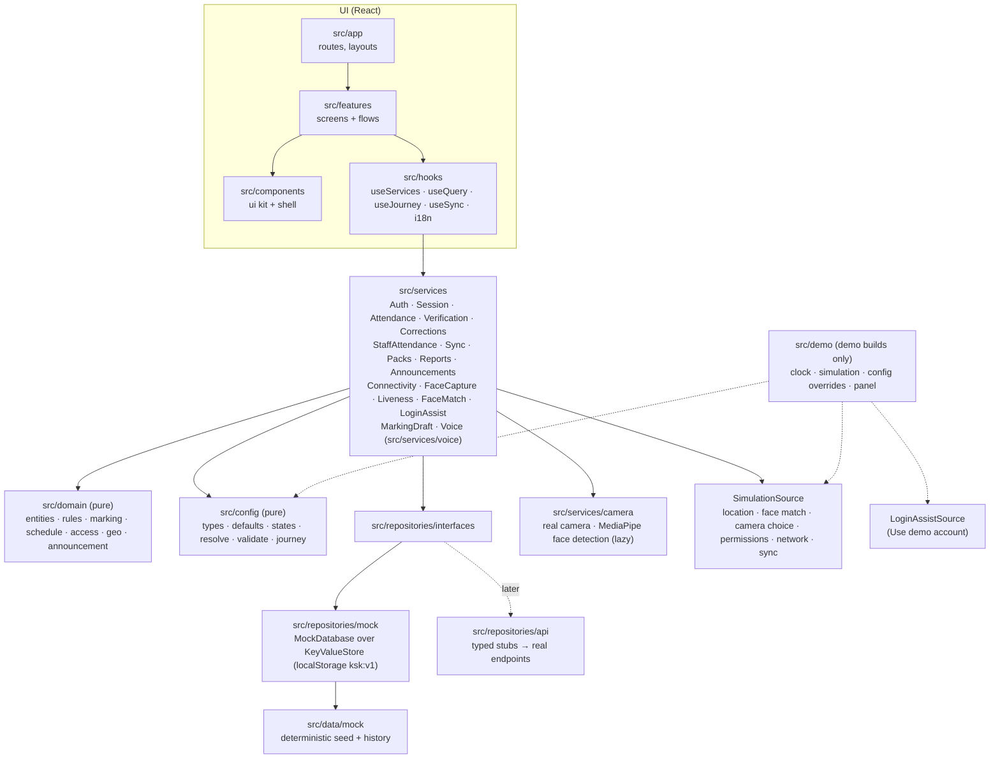
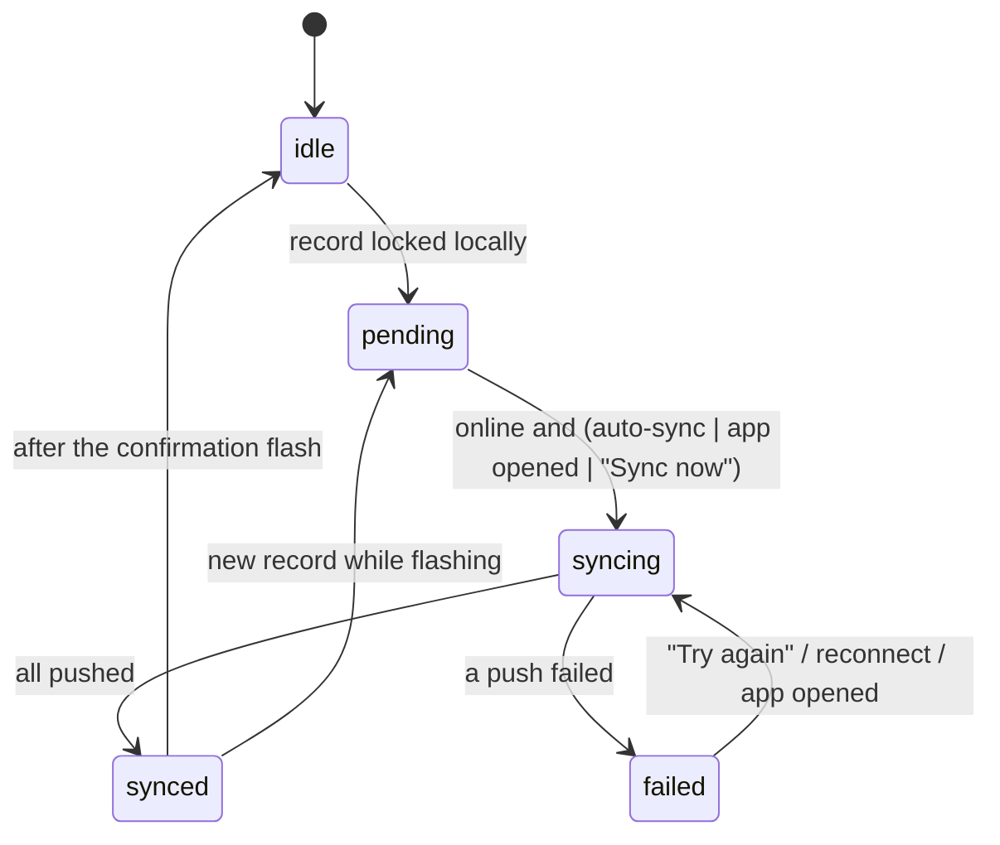
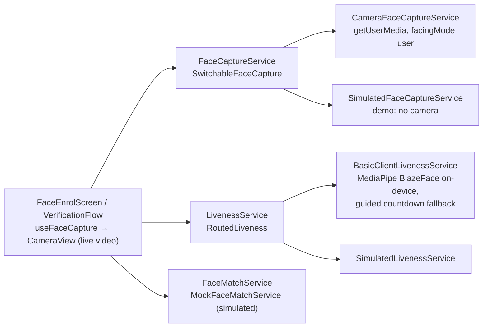
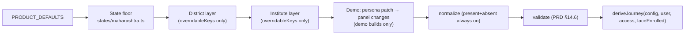

# Architecture

## Shape of the app

This is a **client-first, offline-capable** Next.js 16 App Router app. Every route is prerendered as a static shell, and all data work happens in the browser through services. There are no Server Actions in v1, and exactly one route handler, `POST /api/voice/token`, which only mints a Voice mode token (see Voice mode below). The mock "server" runs in the browser, so the whole demo works offline and deploys to Vercel as static files plus that one function; everything except Voice mode works without it.



Dependency rules are enforced in `eslint.config.mjs`:

| Layer | May import | Must not import |
|---|---|---|
| `src/app`, `src/features`, `src/components`, `src/hooks` | hooks, components, services' **types**, domain, config types, i18n, lib | `@/data/*`, `@/repositories/mock|api`, `@/demo/*`, `@/server/*`; `journey.isPrincipal` |
| `src/services` | domain, config, repository interfaces, lib | mock data and demo code (only `container.ts`, the composition root, wires the mocks) |
| `src/domain`, `src/config` | each other, lib | React, Next, services, repositories, hooks, components |
| `src/domain/voice` | domain, config, lib | everything else; no `Date.now()` or `new Date()` by convention (not lint-enforced: clocks and timestamps are passed in) |
| `src/server` (voice token mint, guards) | `@google/genai`, lib | React, hooks, components, features, services, demo code, mock data, mock repositories. Only `src/app/api/**` may import it, and no other layer may (container, lib, domain and services included) |

## Boot sequence

```mermaid
sequenceDiagram
  participant L as RootLayout (static)
  participant P as AppProviders (client)
  participant B as bootApp()
  participant C as createMockContainer
  participant S as SessionProvider
  L->>P: render; BootSplash until ready
  P->>B: useEffect → bootApp()
  alt NEXT_PUBLIC_DEMO_MODE === 'true'
    B->>B: import('@/demo/adapters') + import('@/demo/controller') → DemoClock, DemoSimulationSource, DemoConfigOverrides, DemoLoginAssist
  else demo off
    B->>B: systemClock, StaticSimulationSource, real connectivity + Geolocation
  end
  B->>C: store(ksk:v1), prefs(ksk-prefs), clock, simulation, overrides, loginAssist
  C-->>B: { repositories, services, bus, clock, simulation }
  B->>B: demo only: loginAssist.connect(prepareScenario)
  B->>B: sync.start() (listens to connectivity; sends leftover queue if online)
  P->>S: ServicesProvider → I18nProvider → SessionProvider → ToastProvider
  S->>S: session.load() → SessionContext { user, institute, config, access, journey, data, clock }
```

`SessionContext` (`src/services/context.ts`) is the snapshot every service call receives: who the user is, their institute, the **resolved configuration**, their **access scope** (which trades and batches they can reach), the **journey** (which steps and controls exist), master data, and the clock. When the configuration changes (in the demo panel), the session reloads and every query refreshes.

## Data flow in the UI

- `useServices()` returns the service instances. Screens never touch repositories.
- `useQuery(key, fetcher, topics)` is a small stale-while-revalidate hook. It re-runs when its key changes or when a repository emits one of its `topics` on the `EventBus` (`session`, `config`, `attendance`, `corrections`, `staff`, `face`, `verification`, `offline`, `packs`, `preferences`, `demo`). It keeps the last data while refreshing, so lists never flash empty.
- `useSyncStatus()` subscribes to `SyncService` through `useSyncExternalStore`.
- Translated strings are produced at render time (`useI18n()`). Services return data, not copy.

## Routing

All pages are static (the one route handler, `POST /api/voice/token`, is dynamic). IDs travel in the query string, so every page can be prerendered and a soft navigation needs no server round trip:

| Route | Screen |
|---|---|
| `/` | Entry redirect (session → `/home`, else `/login`); `?preset=` applies a demo preset |
| `/login`, `/login/institute`, `/login/trainer`, `/login/identity` | Institute code → confirm → Trainer ID → confirm |
| `/face?next=` | Face registration (real camera, prototype movement check, simulated matching), then continue to `next` (validated by `safeNext`) |
| `/home` | Instructor home (notices, today's classes in the mapping model's shape, my attendance, submitted today), or the institute overview for the principal |
| `/attendance` | The principal's institute board (Students / Staff switch). Without the Attendance tab it redirects to `/home` (D-052) |
| `/attendance/trade?trade=` | One trade's batches |
| `/attendance/open?s=` | Gateway: permission primer → verification → roster, or a problem screen |
| `/attendance/mark?s=` → `/review?s=` → `/submitted?s=` | Roster, review and confirm, result |
| `/attendance/record?s=` | Read-only record (principal: correction entry points) |
| `/attendance/correct?s=&student=` | Principal correction with reason |
| `/attendance/staff` | Principal staff marking |
| `/me/attendance` | Self attendance |
| `/reports` | This month's report sections (D-053) |
| `/reports/view?r=&range=` | Detail report with range switch and print view: `staff_summary` or `correction_log` |
| `/voice/diagnostics` | Hidden microphone, speaker and AudioContext checks for a device or WebView; no navigation entry; redirects Home where voice is off (D-087) |
| `POST /api/voice/token` | The only server endpoint: a single-use Gemini Live token (D-078). Dynamic (`ƒ`); everything else is static |
| `/reports/offline`, `/reports/offline/download` | Offline data and download batches, opened from Reports (D-056). `next.config.ts` redirects `/profile/offline*` here, and `/profile` to `/home`: profile is a menu, not a page (D-046) |

`s` is a **session key**: `batchId.date.slot[.subjectId]`, for example `ele-s1u2.2026-09-25.daily`, `ele-s1u2.2026-09-25.p3` or `ele-s1u1.2026-09-25.daily.es`.

## Screen frame, header and navigation (responsive)

**Mobile-first is not a fixed mobile viewport (D-045).** Phones are the primary design; from the SwiftChat medium breakpoint (600px) up, the same screens fill the viewport and keep a readable column instead of a 412px phone frame.

- `ScreenLayout` (`src/components/shell`) is every screen's frame: header → connectivity banner → optional fixed `top` → `main` (the only scroller) → dock (toast, the floating voice controls' anchor, footer, bottom nav). Props that matter for layout:
  - `width`: the content measure from 600px up — `form` 480px, `reading` 800px (roster, review, records, reports, staff), `wide` 1008px (home, class lists). Phones always use the full width.
  - `card`: from 600px up the whole screen becomes a centred form-width card on the page grey (login steps, face intro, permission primers, result and stand-alone problem screens), with the action directly under the content.
  - `area` + `bottomNav`: which destination the screen belongs to (marked current in both navigations) and whether it is a tab root (bottom nav on phones). Class-marking task screens get their `area` and back target from `useAttendanceRoot()`: Attendance where that tab exists, otherwise Home (D-052).
  - `guardNavigation`: lets a screen with unsaved work intercept header / bottom navigation (the principal's unsaved staff marks).
- Gutters are CSS custom properties on the frame (`--gutter-inline`, `--gutter-flush`, `--gutter-footer`, `--gutter-wide`), computed as `max(page margin, (100% − column) / 2)`. The `100%` resolves where each is used, so full-bleed bars (header, banner, footer, summary strips) keep their backgrounds while their content lines up with the column. Use them only on the frame's full-width children: inside `main` (which already applies the gutter), content uses its own 16px. Page margins follow the DS grid (16 / 36 / 64px), and two-column grids use `--page-gutter` (20 / 36 / 36px).
- `main` is the only scroller, and none of its direct children may shrink (`.main > * { flex-shrink: 0 }`), or lists with `overflow: hidden` clip their own rows.
- `inlineFooter`: from 600px, the footer follows the content instead of docking at the bottom edge. It is used for problem and confirmation screens inside the app, so their one action isn't a monitor-height away.
- **One header: `AppHeader`** (`src/features/shell/AppHeader.tsx`) on every signed-in screen with chrome. Phones: a single 60px bar — the KSK brand on tab roots, back + screen title on task screens — with the avatar at the top right. 600px and up: a full-width bar (brand · primary navigation · avatar) aligned to the wide column, plus a context row (back + title) aligned to the screen's column. Immersive single-task steps (camera capture, permission primers, result screens) have no chrome, as in the prototype.
- **Header tool slot** (`src/components/shell/ToolSlot.tsx`): `AppHeader` always renders an empty `display: contents` span in its trailing group, immediately left of the avatar, for tooling outside the product. The demo trigger portals into it (D-057, D-066). The product never puts anything there, and the avatar stays the right-most control.
- **Navigation** (`src/components/shell/AppNav.tsx`) renders the journey's `navTabs` twice: the DS bottom navigation on phones (tab roots only), and a compact row in the header from 600px up. `deriveJourney` decides the tabs: Home always; Attendance only for the institute board (`access.selection === 'institute'`, the principal); Reports when a report block is enabled or offline data is on. Instructors see Home · Reports, the principal Home · Attendance · Reports (D-052). Never a sidebar. Profile is not a destination.
- **Profile menu** (`src/features/profile/ProfileMenu.tsx`): the avatar opens a native `<dialog>` — a bottom sheet on phones, a menu anchored under the avatar on wider screens. Identity (name, role, institute, Trainer ID), language, face registration status, help, logout. It is the single profile entry point.
- Grids go to two columns only where each card still reads at a glance (class cards, the trade list, the principal's two status cards, home's trade overview + My attendance pair), via container or media queries. Never more than two.

## Where the rules live

| Rule | Pure policy | Enforced by |
|---|---|---|
| Submit once, then locked (INV-01/03) | `checkSubmission` → `already_submitted` | `AttendanceService.submit`; `MockAttendanceRepository.createSubmission` does an atomic check-and-set; `saveDraft` refuses after submit |
| No backdating (INV-05/06) | `checkSubmission` / `checkCorrection` → `not_today` | every write path |
| Hard time fence, no grace (INV-20) | `windowState` → `window_not_open` / `window_closed` | `openRoster` and `submit` |
| Verify before the list (INV-16) | `VerificationService.hasPass` | `openRoster` and `submit` require a pass for (user, session, today) |
| Blank default: every row marked; half-day half and leave type chosen | `completenessIssues` → `incomplete` | `submit`; roster footer explains what is missing |
| Principal-only, same-day, reason, real change, not OJT, synced first | `checkCorrection` | `CorrectionService.correct`; corrections are append-only |
| One staff mark per person per day; self precedence | `checkStaffMark` | `StaffAttendanceService`; principal batch-save returns `{ saved, skipped }` |
| Access scope | `resolveAccess` / `canMarkBatch` | `openRoster` and `submit` → `no_access` |
| Disabled means absent | `deriveJourney` | UI renders from the journey; services skip geo/face calls when off |
| Voice: confirm before submit and bulk marking; OJT locked; names only after verification; one live draft | `issueConfirm`/`checkConfirm` (`src/domain/voice/confirm.ts`), `MarkingDraftService.setMark` | the voice executor, over the same `AttendanceService`/`VerificationService` checks as taps (D-082, D-084, D-086) |

Errors are typed `Result` values (`src/lib/result.ts`). Services throw only for programmer errors or `NotImplementedError`.

## Offline and sync

Every write (online or offline) takes the same path. The record is **stored and locked on the device first**, then queued, then pushed.



- `SyncService` (`src/services/sync.ts`) owns the state machine. It is exposed through `ConnectivityBanner` (offline / syncing / failed + Try again / synced), the `SyncPendingCard` on Home and Offline data (D-064; those screens limit the banner to "offline" with `banner="offline"`), and Reports → Offline data (`/reports/offline`). `SyncStatus.lastFailure` (`{at, trigger: 'auto' | 'manual'}`) is kept until an attempt succeeds: automatic triggers call `syncNow('auto')`, a tap calls `syncNow()`.
- Offline marking needs a **downloaded batch pack** (`BatchPackService`). A pack older than `offline.refreshDays` shows a "may be missing new admissions" warning on the roster. Packs refresh all at once (`refreshAll`, PRD §20.3) or one batch at a time (`refreshBatch`, from its card or its Offline data row, D-055). Both only re-stamp the roster: drafts and records waiting to sync are never touched.
- The principal's view shows only what has reached the server. An unsynced record cannot be corrected (`not_synced`).
- Real offline navigation in a WebView would need a service worker for the static shells. That work belongs to production hardening, not this build.

## Face capture, liveness-style check and matching (D-048)

Three separate seams, so a production provider can replace each without touching screens:



- **Camera (real).** `CameraFaceCaptureService` opens the front camera with `getUserMedia({ video: { facingMode: { ideal: 'user' } } })`. The preview is mirrored with CSS only; frames are not. A capture draws the current video frame to a canvas (longest side 640px) and makes an in-memory JPEG `Blob`. The stream is stopped when the screen unmounts. `getUserMedia` failures map to `permission_denied`, `not_found`, `busy`, `unsupported`, `failed` (legacy WebView names included), each with its own problem screen.
- **Movement check (prototype).** `BasicClientLivenessService` loads MediaPipe Tasks Vision **0.10.35** (pinned: 1.0.x posts usage metrics to a Google endpoint with no opt-out, D-049) by dynamic `import()` only on face screens. The wasm runtime is copied from `node_modules` to `public/vendor/mediapipe/<version>/` by `scripts/vendor-mediapipe.mjs` (runs before `dev` and `build`); the BlazeFace short-range model (Apache-2.0, 229,746 bytes, SHA-256 `b4578f35…152f`) is in `public/models/`. Both are served from this origin with a one-year immutable cache. The CPU delegate is used (faster than GPU for this model; avoids known Android WebView GPU failures). About 3.5 MB gzipped on first use, then cached.
  - Rules are pure and unit-tested (`src/services/camera/liveness-rules.ts`).
    - **What each frame must show:** one face (score ≥ 0.7; a second face ≥ 0.5 blocks), sized 28–65% of the preview's short side, with keypoints inside the visible preview and near the oval (a landscape webcam is judged inside its portrait crop), and brightness ≥ 40/255.
    - **Straight:** "Face detected", then "Hold still" for 8 steady frames at |yaw ratio| ≤ 0.10.
    - **Turn left, then turn right:** 3 frames at ≥ 0.18 (about 16°). The head must pass back through centre, or reach the other side, between turns. Eye distance must stay ≥ 75% of frontal, so moving away isn't a turn, and a turn that is too far asks "Turn back a little".
    - **Mirrored cameras:** a steady opposite turn for 1.5 s at the first turn is taken as a mirrored camera.
    - **Guidance** changes only after holding for 2 frames.
    - **Timeouts:** the check gives up after 60 s (registration) or 30 s (daily) and names the dominant reason: too dark, several faces, face not seen, wrong distance, not in the oval, or head turn not seen.
    - **Camera failures:** a preview that never starts, or a camera track that ends, is reported as a camera failure. If the WebView blocks playback without a gesture, a "Tap to start the camera" button appears.
  - **Fallback:** if WebGL is missing, the runtime or model can't load within 12 s, or detection throws, the same steps run as guided captures with a visible 3-2-1 countdown. After two failed checks on a screen, the next attempt is guided too; on the daily check they also count towards `faceRetryLimit`. The demo can force this ("Face detection: Guided only").
  - **What it is not:** production liveness. A printed photo moved by hand or a replayed video can pass it. It checks presence and head movement only.
- **Matching (simulated).** `MockFaceMatchService` never compares faces. Enrolment records `{ staffId, enrolledAt, sampleCount, simulated: true }`; the photos are dropped. Verification returns the demo panel's outcome. Every face screen says "Prototype · photos are not saved · face matching is simulated" while `faceMatch.simulated` is true.
- **Privacy.** Photos live in memory for the current screen only (thumbnails are object URLs, revoked on unmount; a photo that finishes after the screen closed is dropped). `camera.spec.ts` asserts three things during a real-camera registration: nothing image-like in localStorage or sessionStorage, no IndexedDB database, and no request other than same-origin GETs for app files.
- **WebView host requirements.** SwiftChat must grant `RESOURCE_VIDEO_CAPTURE` in `WebChromeClient.onPermissionRequest` (and hold the Android CAMERA permission), allow inline media playback, and load the app over HTTPS. Voice mode also needs `RESOURCE_AUDIO_CAPTURE` granted there, and the app must hold the Android `RECORD_AUDIO` permission (see Voice mode). Otherwise the page sees `NotAllowedError` (shown as "Camera access is blocked", or for voice "Microphone is blocked"). `next.config.ts` sends `Permissions-Policy: camera=(self), geolocation=(self), microphone=(self)`.
- **Production boundary.** Replace `MockFaceMatchService` (and `BasicClientLivenessService`) with a certified provider behind the same interfaces: server-side or on-device matching, certified presentation-attack detection, consent and a retention policy set by the state. The screens need no change; the "prototype" labels disappear when `faceMatch.simulated` is false.

## Location: real or simulated

`LocationProvider.currentPosition` returns a `DevicePosition` with `source: 'device'` (`BrowserLocationProvider`, the Geolocation API) or `source: 'simulated'` (`SimulatedLocationProvider`, the demo's chosen outcome). The source is kept on the captured location (`CapturedLocation.source`) for audit and is never shown to instructors. Demo builds simulate by default; the panel's "Real GPS" defers to the device. Demo-off builds always use the device.

## Voice mode (D-078 to D-132)

An instructor taps the floating **Voice mode** button (bottom-right on every instructor screen, D-133) and marks a batch by speaking, in English or Marathi (D-080, D-087). The agent follows the configured flow: trade (when the mapping model has one), batch or period, the location and face check, marking (roll call or by exception), review and submit. Taps and voice work on the same draft; the screen follows the conversation; the tap UI is untouched when voice is off, blocked or broken.

```
Browser (SwiftChat WebView)                                         Google
+--------------------------------------------------------------+
| features/voice: VoiceProvider . VoiceFloat (button + card)   |
|   useActionBus (router, end) . useScreenSync (route -> flow) |
|                |                         ^                   |
| services/voice v                         | UI events         |
|   VoiceSession -- executor -- ActionBus -+                   |
|     |  |  +-- handlers -> AttendanceService / Verification   |
|     |  |                  MarkingDraftService <-- taps        |
|     |  +-- audio: recorder (worklet 16 kHz) . player 24 kHz  |
|     +-- LiveTransport ---- WSS (token) ----------------------+--> gemini-3.8-live
|          (geminiTransport | ScriptedLiveTransport, demo)     |
+---------------+----------------------------------------------+
                | POST /api/voice/token (same origin)
+---------------v------------------+
| Next Route Handler (Vercel Fn)   |-- authTokens.create (GEMINI_API_KEY) --> Gemini API
| Origin check . rate limit .      |
| VOICE_DISABLED kill switch       |
+----------------------------------+
```

| Layer | Voice code | Rule |
|---|---|---|
| `src/domain/voice` | `types`, `text`, `phrase`, `match`, `lexicon` (matching), `plan` (flow plan), `flow` (step machine, `advance()`), `confirm` (tokens) | Pure TypeScript: no React, Next, services or clock |
| `src/services/marking-draft.ts` | `MarkingDraftService`: the live draft behind taps and voice | Services and repository interfaces only |
| `src/services/voice` | `tools`, `prompt`, `instructions`, `app-events`, `labels` (model-facing text), `executor` and `handlers/`, `action-bus`, `usage` (caps), `session` (+ `session-swap`, `session-tools`, `session-taps`, `trainer-turns`), `service` (`VoiceService`), `live/*` (transport, token client), `audio/*` | No mock data, no demo code. `@google/genai` only in `live/gemini.ts`, loaded by `import()` |
| `src/services/simulated/voice.ts` | `ScriptedLiveTransport`, `SilentAudio` | Wired by `VoiceService` when `simulation.voice === 'scripted'` |
| `src/server/voice`, `src/app/api/voice/token/route.ts` | `guard` (Origin, rate limit), `token` (mint), the route | Server-only; see the dependency table |
| `src/features/voice`, `src/hooks/voice.tsx`, `useVoiceBus.ts` | provider, the floating button and card (`VoiceFloat`, `VoiceCard`, D-133), `VoiceAnnouncer` (the live regions), diagnostics, `useActionBus`, `useScreenSync` | Reads capabilities from `useJourney().voice`; never branches on role |
| `src/demo/voice-puppet.ts` | `window.__kskDemo.voice` | Demo builds only (`check:demo`) |

**How a session runs.**

1. **Start (synchronous in the click).** `VoiceService.start` compiles the flow plan (`compileFlowPlan(ctx, screenLanguage)`, once per session, PRD 5.2), builds the executor, prompt, tools and usage caps, and creates and resumes both AudioContexts before anything is awaited. Then it checks the network and the daily cap, opens the microphone, loads the Gemini transport, fetches the token (raced against 8 s) and connects (raced against the first close and 10 s). It sends a kickoff text, built on the tool queue after any screen or verification hook already queued; the model calls `get_status`.
2. **Voice turn.** Microphone → worklet (640 samples, 40 ms) → `sendRealtimeInput({ audio })`. The model answers with audio, transcripts (captions) and `toolCall`s. Calls run one at a time through the executor and are answered with one `sendToolResponse` in the model's order (D-081).
3. **Executor.** Each handler validates step, access, window, verification and status set, changes state only through `AttendanceService`, `VerificationService` and `MarkingDraftService`, emits Action Bus events, and returns `{ ok, instruction, … }` with a snapshot. The same rules (`src/domain/rules.ts`) hold as for taps (D-079).
4. **Screen follows the conversation.** `navigate` and `end_voice` are applied by `useActionBus`; `show_trade` by `AttendanceBoard` (a choice made while Home was not mounted is replayed when it mounts, unless voice navigated Home since, D-118); `verify_retry` by `VerificationFlow`; `focus_student` becomes the session's focus, and the current `StudentRow` outlines and scrolls itself into view, also when it renders later or is asked for again (D-128). Model text never changes the screen (D-085).
5. **Taps flow back.** Draft changes (`MarkingDraftService.subscribe('*')`), route changes (`useScreenSync` → `onScreen`), a trade tapped on Home's switcher and verification events (`VerificationService.subscribe`) become English `[APP]` texts for the model. The texts are dropped while the session is paused or not live, but the executor still follows each event quietly (it moves the flow, and issues no code and pushes no screen), also while Reconnect shows; the next kickoff or Resume reads the moved flow (D-085, D-086, D-122). Another batch's record screen while a batch is open by voice is ignored (D-126).
6. **Verification (D-086).** `select_batch` navigates to `/attendance/open?s=`. The gateway runs location and face as for taps; `VerificationService` events become `[APP]` texts with app-formatted distances. The microphone pauses while the face camera is on. No student field reaches the model before the pass.
7. **Submit.** `submit_attendance` without a code opens the review and answers `NEEDS_CONFIRMATION` with a code and the counts sentence. The model asks; the trainer says yes in a new turn after the asking turn ended (D-112); the model calls again with the code; the executor checks it (D-082) and calls `AttendanceService.submit`. The code dies when the flow leaves the review (D-110). A tap submit goes through the same service call and tells the model. Either submit holds the live draft while it saves (`MarkingDraftService.beginSubmit` / `whileSubmitting`): every tap and voice mark is refused meanwhile, voice answers `SUBMITTING` and issues no code, and a voice yes during the screen's save starts no second save, so what was sent is the record (D-111).
8. **goAway and drops.** A fresh token is fetched while the old connection still works; the old connection is closed and a new one opened with the resumption handle, at a quiet moment or 2.5 s before the deadline. The executor's refresh text goes first (where things stand, spoken facts), then the held microphone audio (at most 3 s), preceded by the 0.64 s pre-roll only after a quiet-moment swap (`session-swap.ts`, D-121). An unexpected close shows **Reconnect**; three failed connects in a row stop voice (D-114). A hidden WebView stops sending audio (`audioStreamEnd`); after 20 s hidden it pauses as Use screen does (status Paused, **Resume voice**). The connection stays open, and that pause keeps the idle clock running, so the idle timeout ends the session if the trainer does not come back (D-120). While paused, the agent's audio and captions are neither played nor shown (D-123).
9. **Caps (D-089).** The three minute caps (session minutes across reconnects, daily minutes in `ksk:v1` `voiceUsage`, the idle timeout) stop the session after a goodbye line (at most 4 s); 40 calls a minute, 5 failures in a row and 3 failed connects in a row stop it at once ("Voice had trouble"). Trainer speech, taps, screen and verification signals, tool calls and the page becoming visible again are activity; only Use screen on a visible page holds the idle clock (D-119). The draft is always kept.

**What the server does.** `POST /api/voice/token` checks the `Origin` against the request host (and `VOICE_ALLOWED_ORIGINS`), limits each client IP to 20 tokens in 10 minutes per server instance (D-107), honours `VOICE_DISABLED=1`, and mints a token with `GEMINI_API_KEY` (single use, new session within 60 s, expiry 30 min, model and AUDIO locked). It answers `{ token, expiresAt, model, apiVersion }`, or 403, 429 or 503 with no detail. Every answer is `Cache-Control: no-store`. The key never reaches the browser, a log or an error text. See `docs/voice/RUNBOOK.md`.

**WebView host requirements (voice).** SwiftChat must grant `RESOURCE_AUDIO_CAPTURE` in `WebChromeClient.onPermissionRequest`, the app must hold `RECORD_AUDIO`, and the page must load over HTTPS with `AudioWorklet` available. `/voice/diagnostics` checks all of it on a device. The Voice mode button is absent where `AudioWorklet` or `getUserMedia` is missing, and disabled offline.

**Announcements and focus.** `VoiceAnnouncer`, rendered by `VoiceProvider` (it outlives the voice card and every route), owns two visually hidden live regions: a `role="alert"` region that reads each new voice error once, and a polite status region that says "Voice ended" when voice turns off. The dock's error line is visual only. When voice turns off and focus went down with the dock, focus moves to `main#main` (D-127).

**Not built here.** A relay and Vertex AI, server-side counters and audit, principal voice (corrections, staff), offline voice, Devanagari name data and a pilot consent flow (design §13).

## Configuration resolution



See [CONFIGURATION.md](CONFIGURATION.md) for every option.

## Demo isolation

- All demo code is in `src/demo`. Two places load it, each through an inline `process.env.NEXT_PUBLIC_DEMO_MODE === 'true'` comparison so the bundler can drop the branch: `bootApp()` (adapters and `prepareScenario`) and `AppProviders` (the `DemoRoot` panel). `next.config.ts` defaults the flag to `'true'` when unset (a Vercel build from git has no `.env` file), so only an explicit `false` strips it (D-067).
- `npm run check:demo` builds with the flag off and fails if a demo marker reaches the output. The markers are strings in JS and HTML ("Use demo account", "Quick login", "Skip login screens", and others) and demo CSS (`html[data-demo-float]`, the reserve values).
- Demo state lives in its own namespace (`ksk-demo:v1`). Reset Demo clears `ksk:v1`, `ksk-demo:v1` and `ksk-prefs`, then reloads.
- **Login assist seam.** The product defines `LoginAssistSource` (`src/services/login-assist.ts`): `get()` (label, options, a highlighted suggestion), `choose(id)` and `credentials(id)`. The container exposes `services.loginAssist` (null in production). The demo's `DemoLoginAssist` (`src/demo/adapters.ts`) offers five demo accounts. `choose` prepares that account's preset through `prepareScenario`, which `boot.ts` connects once the container exists. The login screens render `LoginAssistPicker` only when a source exists, and a field is filled only after a pick. No demo copy or credentials live in product code (D-058).
- **Demo trigger and panel.** `DemoRoot` renders the app plus a collapsed "Demo" trigger and a native `<dialog>`.
  - Where there is an app header, the trigger is portaled into the header tool slot. On headerless screens it floats (top right on phones, bottom right from 600px) and sets `html[data-demo-float]`, the only time layout reserves apply (D-036, D-057).
  - The dialog is a modal bottom sheet on phones, and a non-modal drawer on the right (the trigger's side), below the header, from 600px, so the app stays usable while settings change. It never takes layout space, and the panel's content mounts only while open.

## Storage namespaces

| Namespace | Owner | Contents |
|---|---|---|
| `ksk:v1` | `MockDatabase` | submissions, drafts (with the source of each trainer mark: tap or voice and when; what was heard only when `voice.transcriptRetentionDays` is above 0, D-084, D-113), corrections, staff records, face enrolments (the fact of enrolment only: date and photo count, never an image), verification passes, offline queue, batch packs, session, `voiceUsage` (voice seconds used per trainer per IST day, for the daily cap, D-089), seed marker |
| `ksk-prefs` | `DevicePreferencesRepository` | language (read before hydration by the boot script in `layout.tsx`) |
| `ksk-demo:v1` | `DemoStateRepository` | preset, selected persona, "skip login", config overrides, simulation (incl. camera choice), clock |

`LocalStorageStore` throws `StorageWriteError` when a write fails (quota or private mode). `createDefaultStore` falls back to an in-memory store when the WebView blocks or lacks localStorage.

## Going live (what replaces the mocks)

1. **Implement `src/repositories/api/*`.** Each stub documents its endpoint. Wire them in a new `createApiContainer()` beside `createMockContainer()`. No screen changes.
2. **Authentication.** Replace `MockAuthService` with SwiftChat identity (or institute code + Trainer ID + a second factor, PRD open question 1). Tokens must stay out of client code; use the host bridge or httpOnly cookies from an API.
3. **Face verification.** Keep `CameraFaceCaptureService`; replace `MockFaceMatchService` and `BasicClientLivenessService` with a certified matching and presentation-attack-detection provider behind `FaceMatchService` / `LivenessService`, with consent, retention and on-device or server matching decided by the state. Today the camera and movement check are real; matching is a simulation.
4. **Location.** `BrowserLocationProvider` exists. Confirm that the SwiftChat WebView grants geolocation, or add a host bridge.
5. **Offline shells.** Add a service worker (or the host's cache) so routes load with no network.
6. **Server-side rules.** The server must re-check every invariant in `src/domain/rules.ts`. The client checks are for UX, not trust.
7. **Set `NEXT_PUBLIC_DEMO_MODE=false`** in the production environment (for example the Vercel project settings). Unset means the demo build (D-067). Then run `npm run check:demo`.
8. **Voice mode.** Move the caps and the daily usage next to the token route in a server store (D-089), or put a relay in front of Gemini (and Vertex AI, with its regions and data terms confirmed in the GCP project): authenticate the trainer there, hold the Live connection, and run the tools against the real APIs. The executor, flow plan, prompt and tool builders are pure and move unchanged (D-079). Re-check every rule server-side. Implement `ApiVoiceUsageRepository`, then confirm with the SwiftChat team that the WebView grants `RESOURCE_AUDIO_CAPTURE` and the app holds `RECORD_AUDIO`.
