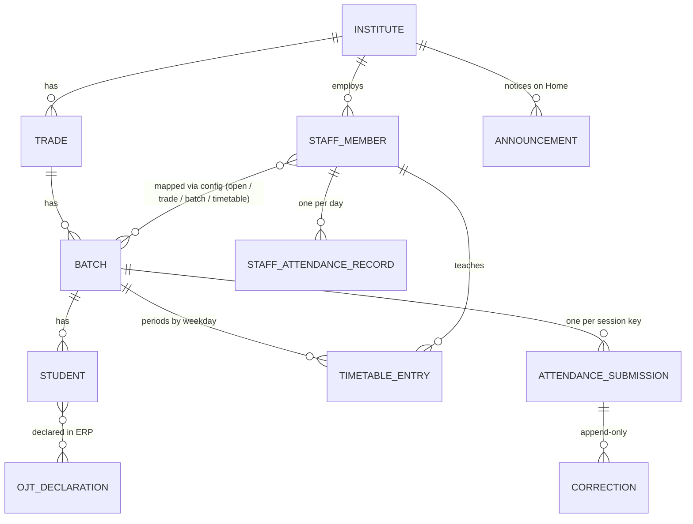

# Data model

The model is shared by every state (PRD §4); only the rules layered on top of it vary. Types live in `src/domain/*.ts` and are pure TypeScript.



## Master data (`src/domain/entities.ts`)

| Entity | Key fields | Notes |
|---|---|---|
| `Institute` | `id`, `code` (first login credential, e.g. `27410`), `name`, `shortName`, `district`, `locality`, `location` (lat/lng), `shiftWindows?` | `shiftWindows` override the state windows when `time.instituteOverride` is on |
| `Trade` | `id`, `instituteId`, `name`, `durationYears` (1 or 2) | |
| `Subject` | `id`, `name` | Cross-trade subjects, e.g. Employability Skills (`es`) |
| `Batch` | `id` (e.g. `ele-s1u2`), `tradeId`, `shift` (1 or 2), `unit`, `year` | Rendered as "Shift 1 · Unit 2" |
| `Student` | `id`, `batchId`, `rollNo`, `name`, `fatherName` | The father's name is always shown on the roster (PRD §4.3) |
| `StaffMember` | `id`, `instituteId`, `trainerId` (login credential), `name`, `role` (`instructor` / `group_instructor` / `principal` / `office_staff`), `employmentType` (`regular` / `contractual` / `guest`), `designation`, `primaryTradeId?`, `secondaryTradeIds`, `batchIds` (explicit allow-list), `subjectId?`, `multiTradeAllowed` | Employment type is shown, never used for permissions (PRD §3.1) |
| `TimetableEntry` | `batchId`, `instructorId`, `weekday` (0 = Sunday), `periodNo`, `kind` (theory / practical), `window`, `subjectId?` | An input from the ERP; this app never edits it |
| `OjtDeclaration` | `id`, `studentIds`, `from`, `to` | Declared by the principal in the ERP; shown here as locked OJT rows |

## Marks and statuses (`src/domain/status.ts`)

```ts
type StatusCode = 'present' | 'absent' | 'half_day' | 'leave' | 'ojt';
interface Mark { status: StatusCode | null; half?: 1 | 2; leaveType?: 'sick' | 'casual' | 'medical'; leaveUntil?: string }
```

`status: null` means not yet marked (blank default). `STATUS_REGISTRY` holds, per status: icon, tone, whether instructors can select it (OJT cannot), and its **presence weight** for percentages (present 1, half day 0.5, OJT 1, absent and leave 0).

## Sessions and records (`src/domain/attendance.ts`)

A **session** is one thing to mark: a batch, on a date, in a slot, optionally for a subject.

```ts
type MarkingSlot = { kind: 'daily' } | { kind: 'half'; part: 1 | 2 } | { kind: 'period'; periodNo: number };
interface SessionAddress { batchId; date /* YYYY-MM-DD, IST */; slot; subjectId? }
// SessionKey = batchId.date.slot[.subjectId]
//   ele-s1u2.2026-09-25.daily   ele-s1u2.2026-09-25.h1   ele-s1u2.2026-09-25.p3   ele-s1u1.2026-09-25.daily.es
```

| Record | Fields | Lifecycle |
|---|---|---|
| `AttendanceDraft` | `sessionKey`, `marks`, `sources?` (per student: `via` `tap` / `voice`, `at`; `heard` (≤ 160 characters) in the live draft only, saved only when `voice.transcriptRetentionDays` > 0, D-113), `updatedAt` | Saved on every change by `MarkingDraftService` (below). Survives leaving the screen and a reload. Refused once the session is submitted. Defaults and presets (OJT, carried leave) have no source |
| `AttendanceSubmission` | `id`, `sessionKey`, `address`, `marks`, `markedBy`, `deviceTimestamp`, `serverTimestamp?`, `location?` (lat, lng, `accuracyM`, `distanceM?`, `source?`: `device` / `simulated`), `syncState` (`pending` / `synced` / `failed` / `rejected`: the server refused it for good because another device submitted that session first; kept on the device, never pushed again, and the server's copy wins, D-143) | **Written once** (atomic check-and-set on the session key), then locked for everyone. The device and server timestamps are both kept (PRD open question 2, clock trust) |
| `Correction` | `correctionId`, `attendanceId`, `studentId`, `oldMark`, `newMark`, `reason`, `actorId`, `timestamp` | **Append-only.** The submission is never changed; `effectiveMarks(submission, corrections)` folds them in append order. On Supabase the table also has `seq` (a server identity, never sent by the client): every device lists corrections by (timestamp, `seq`, `correctionId`), with this device's unsent outbox last, so the order is the same everywhere (D-143) |
| `StaffAttendanceRecord` | `id`, `staffId`, `date`, `status`, `source` (`self` / `principal`), `markedBy`, `deviceTimestamp`, `location?`, `syncState` | One per staff member per day across both paths; the first mark wins |
| `OfflineQueueItem` | `id`, `kind` (`attendance_submission` / `staff_attendance`), `recordId`, `label`, `enqueuedAt`, `attempts`, `lastError?` | Created for every locked record; removed when the push succeeds |

Device-held records (`src/domain/device.ts`):

| Record | Fields | Notes |
|---|---|---|
| `BatchPack` | `batchId`, `downloadedAt` | A downloaded roster for offline use; stale after `offline.refreshDays`. A refresh (all packs, or one batch: D-055) re-stamps `downloadedAt` |
| `FaceEnrolment` | `staffId`, `enrolledAt`, `sampleCount`, `simulated: true` | Records only that registration happened and how many photos were taken. The photos themselves (in-memory `CapturedFrame` JPEGs) are never stored; no image or template exists anywhere (D-048) |
| `VerificationPass` | `staffId`, `purpose` (`session:<key>` or `self`), `date`, `grantedAt`, `location?` | Proof that verification ran for this user, session and day |

**The live draft (`src/services/marking-draft.ts`, D-084).** `MarkingDraftService` keeps one `DraftSnapshot` per session key: `students` (roll order), `marks`, `sources`, `presets` (OJT, and carried leave nobody has marked), a `revision` that grows on every change, and `locked`. The marking and review screens render it through `useSyncExternalStore`; the voice executor writes the same draft. `open()` seeds it from `openRoster` (which merged the saved draft and its still-valid sources) and keeps the live draft while the configuration is equal by value (every session reload builds a new but equal object, D-105); a configuration that really differs rebuilds it. `setMark` / `setMany` refuse OJT (taps and voice alike), unknown students, a closed draft and a draft a submit is saving. An equal mark is a no-op, except that a voice mark on a student with no trainer source records the source (D-104). A detail for the same status is merged. Every change emits a `DraftChange` (`opened`, `mark`, `bulk`, `submitted`, `closed`) and is written to `AttendanceDraft` at once, without `heard` unless `voice.transcriptRetentionDays` is above 0 (D-113); `flush()` awaits the write before Review. **Submit hold (D-111).** `beginSubmit(key)` returns the snapshot to send and holds the draft until `endSubmit(key)`; holds are counted, so the screen's and voice's submits can overlap. `whileSubmitting(key, save)` (the review screen's path) takes the hold, runs `save`, and releases only a hold it took. While held, every mark is refused (no change, no event), so the snapshot sent is the record; `close(key, { kind: 'submitted', via, sent })` emits the `submitted` change with `{ ...sent, locked: true }`. `AttendanceService.saveDraft` (marks only) is kept for integration tests only: the screens and the voice executor write through `MarkingDraftService`. It keeps the stored source of every student whose mark is unchanged and drops the source of a changed mark (its maker is unknown), so a voice roll call calls those students again.

Services add what the screens need on top: `BatchPackService.list` returns `PackRow` (`batch`, `trade`, `pack`, `stale`, `pendingSync`: that batch's records waiting to sync), and each `SessionCard` carries `pack?: { downloadedAt, stale }` for the card's "Updated · Refresh data" strip.

## Announcements (`src/domain/announcement.ts`, extension, D-054)

| Field | Values |
|---|---|
| `category` | `info` / `important` / `holiday` / `ojt` |
| `priority` | `high` / `normal` (high leads the Home strip) |
| `source` | `state` / `institute` / `principal` |
| `audience` | `{ kind: 'institute' }`, `{ kind: 'trade', tradeIds }`, `{ kind: 'batch', batchIds }` or `{ kind: 'staff', staffIds }` |
| `title`, `body` | `LocalizedText`: `{ en, mr? }`; English is required and is the fallback |
| `publishedAt`, `showFrom`, `showUntil` | Shown on Home from `showFrom` to `showUntil`, inclusive |
| `eventFrom?`, `eventTo?` | The day or days the notice is about (a holiday, an OJT period) |

`isForReader` never crosses institutes, and the principal reads everything at their own. Order: high priority, then important > holiday > OJT > info, then newest. Notices are information only: an OJT notice marks nobody OJT.

## Repository interfaces (`src/repositories/interfaces/index.ts`)

| Interface | Responsibility | Mock | API (later) |
|---|---|---|---|
| `MasterDataRepository` | Institutes, trades, subjects, batches, students, staff, timetable, OJT; one batch's roster for a pack download or refresh (`getBatchRoster`) | `src/data/mock` | `GET /institutes?code=`, `GET /institutes/{id}/staff?trainerId=`, `GET /institutes/{id}/bundle`, `GET /institutes/{id}/batches/{batchId}/roster` |
| `AttendanceRepository` | Drafts; `createSubmission` (write-once); list by batch or date range; mark synced or rejected | `MockDatabase` | `GET /attendance?batchIds=&from=&to=`; pushes go through `SyncGateway` |
| `CorrectionRepository` | Append and list corrections (append-only) | `MockDatabase` | `POST /attendance/{attendanceId}/corrections`, `GET /corrections?…` |
| `StaffAttendanceRepository` | `get`, `getById`, `listForDate`, `listBetween`, `create` (one per day), `markSynced`, `markRejected` | `MockDatabase` | reads from the API; pushes through `SyncGateway` |
| `FaceEnrolmentRepository` | Enrolment status (matching simulated); `remove` for the demo's face toggles | `MockDatabase` | provider-specific (the matcher owns any template) |
| `VerificationRepository` | Passes per user, purpose and day | `MockDatabase` | device-local |
| `OfflineQueueRepository` | The outbox | `MockDatabase` | device-local (IndexedDB) |
| `BatchPackRepository` | Downloaded batches | `MockDatabase` | device-local, filled from `GET /institutes/{id}/bundle` |
| `AnnouncementRepository` | `listForInstitute` | built per day from `src/data/mock/announcements.ts` (not stored) | `GET /institutes/{id}/announcements?active=true` |
| `SessionRepository` / `PreferencesRepository` | Signed-in session / language | `ksk:v1` / `ksk-prefs` | host identity / device |
| `SyncGateway` | Pushes one queue item to the server | simulated (can fail once) | `POST /attendance` (idempotent on submission id), `POST /staff-attendance` |
| `VoiceUsageRepository` | Voice seconds used per trainer per IST day (`get`, `add`), for the daily cap (D-089) | `MockDatabase` (`voiceUsage`) | `GET /voice/usage?staffId=&date=`, `POST /voice/usage` |

The API stubs are in `src/repositories/api/repositories.ts`. Each throws `NotImplementedError` and documents the endpoint it will call.

A third implementation, `src/repositories/supabase/*` (D-143), serves the server-owned interfaces (master data, announcements, attendance, corrections, staff attendance, voice usage, face enrolment, the sync gateway) from the shared Supabase project, and keeps the device-owned ones (verification, offline queue, packs, session, preferences) on `MockDatabase`. Its tables mirror the domain types column for column (plus `corrections.seq`); rows are validated before use (`validate.ts`); see `docs/SUPABASE.md`.

## The monthly register (D-137)

`ReportService.register` returns an `AttendanceRegister` (`src/services/report-register.ts`): the institute, the month (its first day), `to` (the month's end, or today for the current month), `today`, the threshold and `atRiskMinDays`, the generation time from the injected clock, who prepared it (name and role), and one `BatchRegister` per batch. A `BatchRegister` has the batch and trade, the instructor who marked most (or null), every day of the month (`RegisterDay`: date, weekday, kind `class` / `none` / `pending` (today, not submitted yet) / `upcoming`, and the day's weighted present count), one `RegisterRow` per student (the student, a `RegisterCell` or null per day with the statuses after corrections in slot order, the day's presence share and a corrected flag, then days present by presence weight, absent and leave days, marked days, % with threshold-safe rounding, at risk), the class days, the batch % and whether it is low, how many meet the threshold and how many are at risk, the corrections (`RegisterCorrection`: date, student name and roll, from and to marks, reason, the actor's name, when) and how a day is recorded (`once`, `twice`, `period`). Nothing is stored: it is computed from the records on each request.

## Mock data (`src/data/mock`)

- **Government ITI Pune** (`inst-27410`, code **27410**, Aundh, Pune District): 5 trades (Electrician, Fitter, Welder, COPA, Mechanic Diesel), **17 batches** across two shifts, **417 students**. A second institute, **Government ITI Nashik** (code 27613), proves institute scoping.
- Rosters are deterministic (seeded PRNG), so every demo shows the same names. `ele-s1u2` uses the prototype's roster (Aarav Pawar, Aditi Joshi…). Pinned students for the story: **Rahul Kumar** (`ele-s1u1`, roll 21, absent today; the principal corrects him) and **Kiran Wagh** (`fit-s1u1`, roll 4, corrected yesterday).
- Personas (Trainer IDs): Rajesh Patil `TR-10432` (open), Sanjay More `TR-10455` (Fitter + Welder), Sunita Jadhav `TR-10518` (two batches), Vikas Shinde `TR-10377` (timetable), Meera Kulkarni `TR-11024` (Employability Skills, 5 batches in 4 trades), Yogesh Dalvi `TR-10390` (group instructor), Dr. Anil Deshmukh `PR-2741` (principal).
- **History:** generated deterministically at read time (never stored) for any past working day (Monday–Saturday; `HISTORY_DAYS` = 45 is exported but reads aren't limited to it), with low-attendance students (Tushar Yadav, Sagar Nikam) and about 8% of trainees with a habit below 75%, so reports have something to flag. `SUBJECT_HISTORY` adds each subject instructor's daily session per batch (ids `hist-es~<batch>-<date>`), so the Employability Skills persona has reports too (D-061).
- **Announcements** (`announcements.ts`, relative to today): six notices for Pune covering every audience and category, in English and Marathi. A holiday on the next working day (high priority, institute-wide), an upcoming OJT period for `ele-s1u1` (with a matching ERP declaration in `seeds.ts`), an Electrician Shift 2 timing change, a Welding workshop closure (trade `wel`), a practical exam (state office) and an instructor meeting for five named instructors.
- **Today's seed** (`seeds.ts`, relative to the current date):
  - submitted by 09:30–09:52: `ele-s1u1` (Rajesh, 2 absent), `fit-s1u1`, `wel-s1u1`, `copa-s1u1`, and `ele-s1u2` Period 2 (Vikas);
  - 13 staff self-marked between 07:48 and 09:15;
  - yesterday's correction for Kiran Wagh;
  - OJT declarations (in `buildMasterData`, part of the day's master data): rolls 6 and 13 of `ele-s1u2`, the whole of `md-s2u1`, and the whole of `ele-s1u1` for six days from two days ahead (the OJT notice);
  - seven batches downloaded at 07:45 today, and `fit-s1u2` downloaded 8 days ago (stale).

## Storage

All mock records live in localStorage under `ksk:v1:<collection>`, through `KeyValueStore` (`src/lib/kv-store.ts`). `MockDatabase` reseeds on first use, on a schema version bump and when the calendar day changes. On the Supabase source it holds only the device-owned data and this device's records until they sync, and a day change keeps the queue, unsynced records, corrections, the device's downloaded packs and waiting face flags (a demo preset or Reset writes the preset's story packs); a live server read removes this device's synced records the server no longer has; cached server answers, the correction outbox and the face outbox live in `ksk-cache:v1`. **Reset Demo** clears `ksk:v1`, `ksk-demo:v1` (keeping the Data choice), `ksk-prefs` and `ksk-cache:v1`. IndexedDB can replace localStorage behind the same interface if the data grows.
